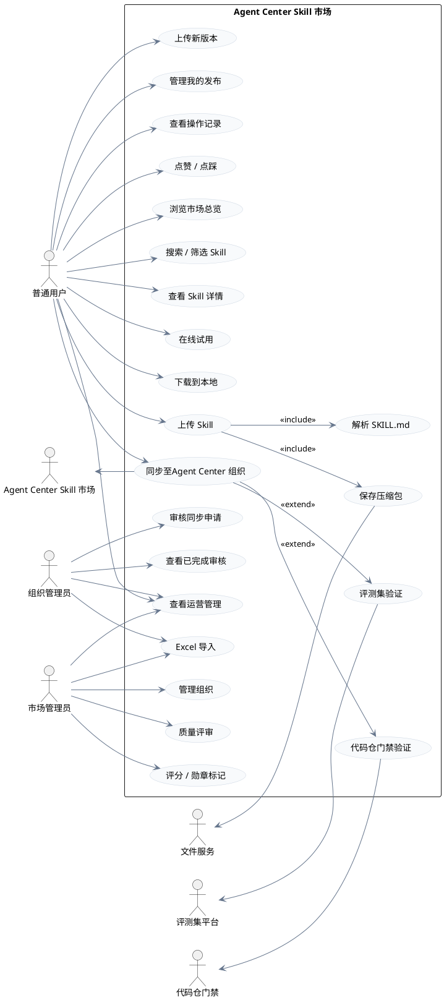
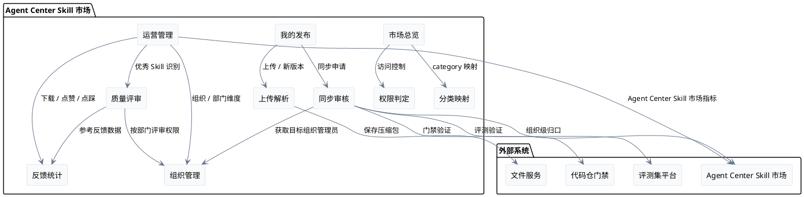
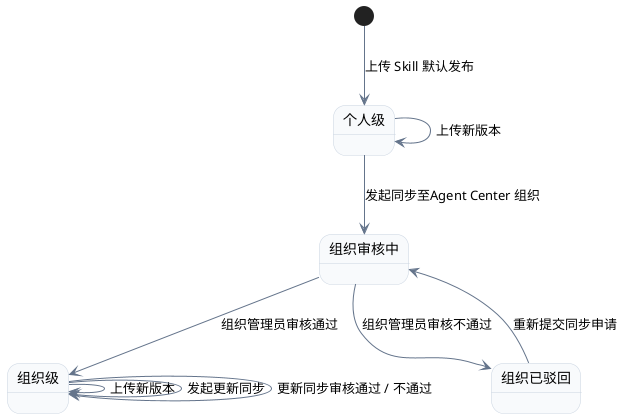
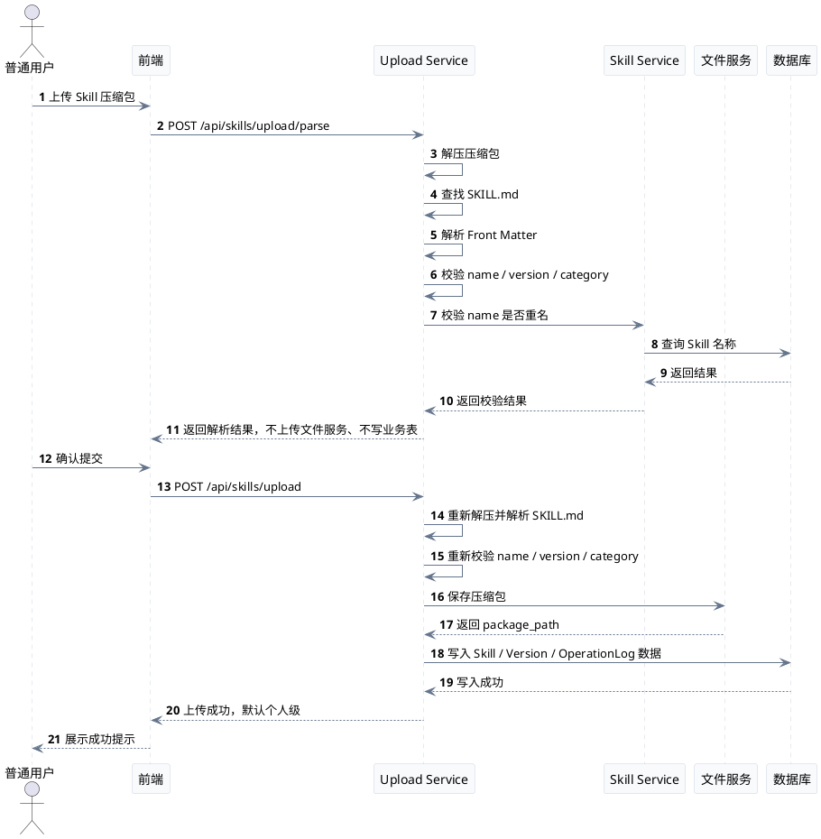
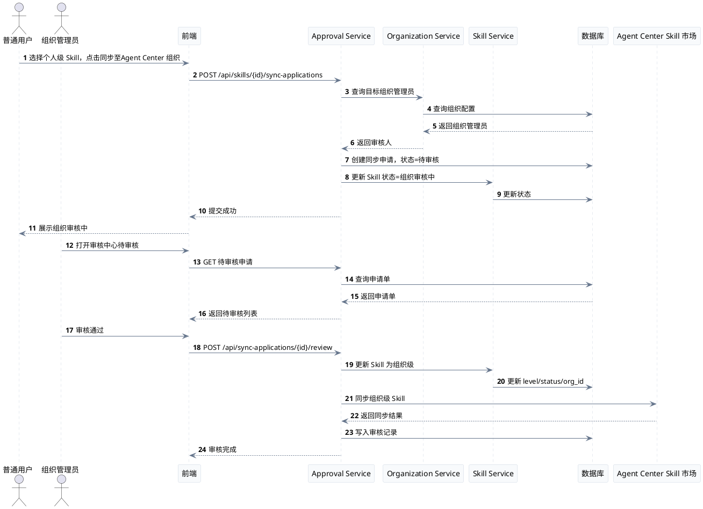
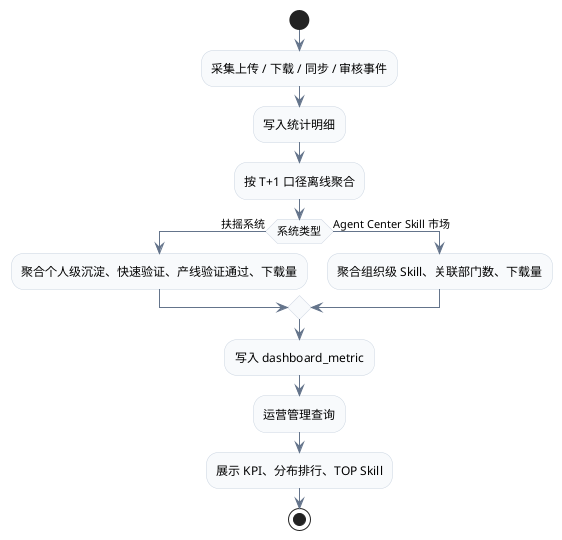
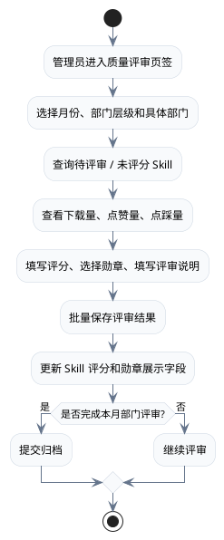
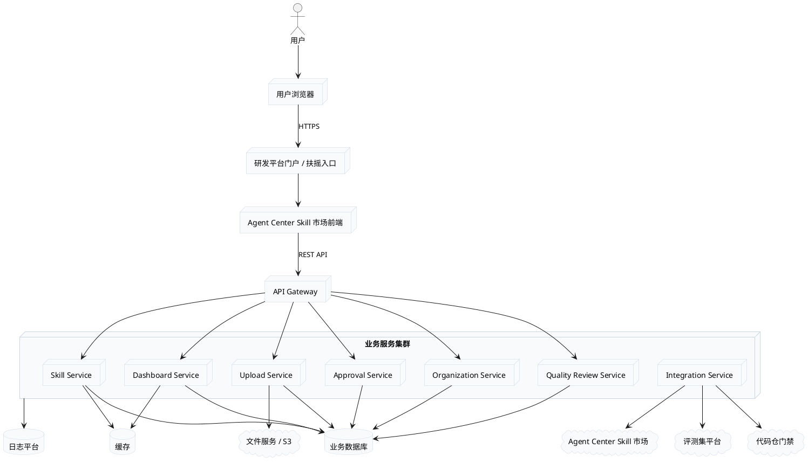

# Agent Center Skill 市场需求开发设计文档

## 文档信息

| 项目     | 内容                                                                     |
| -------- | ------------------------------------------------------------------------ |
| 文档名称 | Agent Center Skill 市场需求开发设计文档                                  |
| 系统定位 | Agent Center Skill 市场，作为Agent Center Skill 市场的前置沉淀与验证平台 |
| 自研平台 | 扶摇系统                                                                 |
| 目标系统 | Agent Center Skill 市场                                                  |
| 当前版本 | V1.0 原型设计版                                                          |
| 适用范围 | SKILL开发人员、产业CMC                                                   |

---

# 1. 需求分析

## 1.1 背景说明

Agent Center Skill 市场，负责公司层面的组织级 Skill 管理、发布验收、安全治理和统一分发。

产业侧建设 Agent Center Skill 市场，作为轻量前置平台，承接日常作业场景中的 Skill 快速发布、沉淀、试用、评测验证和向Agent Center Skill 市场组织级同步。

自研 Agent Center Skill 市场的核心价值：

1. 个人级 Skill 可在扶摇系统内灵活上传和快速发布。
2. 用户可将零散的日常作业经验沉淀为可复用 Skill。
3. 平台支持个人级 Skill 快速试用、下载和反馈验证。
4. 个人级 Skill 同步至组织级时，先遵从产业 / 产线侧发布验证标准。
5. 同步流程支持接入评测集、代码仓门禁、安全扫描等能力。
6. 组织级 Skill 由Agent Center Skill 市场统一管理。

## 1.2 系统定位

| 系统                    | 定位                    | 核心职责                                              |
| ----------------------- | ----------------------- | ----------------------------------------------------- |
| 扶摇系统                | Agent Center Skill 市场 | 个人级 Skill 发布、沉淀、试用、快速验证、同步前置治理 |
| Agent Center Skill 市场 | Agent Center Skill 市场 | 组织级 Skill 统一管理、发布验收、安全治理、统一分发   |

## 1.3 建设目标

### 1.3.1 业务目标

1. 建设轻量 Agent Center Skill 市场，用于沉淀和复用日常作业经验。
2. 支持个人级 Skill 快速上传、自动解析和默认发布。
3. 支持个人级 Skill 同步至Agent Center 组织，形成组织级 Skill。
4. 支持目标组织管理员审核同步申请。
5. 支持组织管理，配置组织名称、组织 ID、组织管理员。
6. 支持市场总览、我的发布、审核中心、组织管理、运营管理。
7. 支持运营管理在扶摇系统与Agent Center Skill 市场之间切换。
8. 支持同步流程接入评测集、代码仓门禁、安全扫描和Agent Center Skill 市场发布验收。
9. 支持管理员按月、按部门对 Skill 进行集中质量评审。
10. 支持优秀 Skill、推荐复用、待优化、高分 Skill 等质量勋章识别。
11. 支持下载量、点赞量、点踩量等反馈指标展示与运营统计。
12. 支持超级管理员、普通管理员、普通用户三类角色。
13. 支持超级管理员通过独立超级管理员表维护工号，具备新增组织和修改所有组织配置的能力。
14. 支持普通管理员按组织授权，只能操作自己管理的组织配置和该组织下的审核、评审、统计数据。

### 1.3.2 产品目标

1. 用户能理解 Skill 的定义和使用价值。
2. 用户能完成 Skill 上传、查看、试用、下载。
3. 用户能清晰查看个人级 Skill 的状态。
4. 管理员角色由超级管理员表和组织管理员配置共同生成。
5. 运营管理聚焦 Skill 数量、下载量、点赞量、点踩量和优秀 Skill 识别。
6. 页面风格轻量、清晰，并适配嵌入式平台场景。
7. 管理员可以在独立质量评审页签中集中完成评分、打标和归档，不依赖单个 Skill 详情页操作。
8. 市场总览支持按勋章、评分状态和未评分 Skill 筛选。
9. 前端根据当前用户角色动态展示管理入口，普通用户不展示组织管理、审核中心、质量评审和超级管理员配置入口。

## 1.4 核心概念

### 1.4.1 个人级 Skill

用户上传后默认发布为个人级 Skill，无需审核。个人级 Skill 可在扶摇系统中被搜索、查看、试用、下载和沉淀。

### 1.4.2 组织级 Skill

个人级 Skill 经过同步至Agent Center 组织流程，并由目标组织管理员审核通过后，成为组织级 Skill。组织级 Skill 按Agent Center Skill 市场口径进行统一管理。

### 1.4.3 组织

组织是审核和治理的基本单元。组织配置包含：

| 字段       | 说明                                             |
| ---------- | ------------------------------------------------ |
| 组织名称   | 组织展示名称，例如 IT装备部、质量工具组、SRE团队 |
| 组织 ID    | 组织唯一标识，例如 ORG-IT-001                    |
| 组织管理员 | 多个管理员账号或工号，英文逗号分隔               |
| 状态       | 启用 / 停用                                      |

### 1.4.4 超级管理员

超级管理员是平台最高管理角色，通过独立超级管理员表维护用户工号，不依赖组织管理员字段。

超级管理员配置只维护平台级管理授权，不直接改变用户所属部门和 Skill 归属组织。

超级管理员配置字段：

| 字段 | 说明                       |
| ---- | -------------------------- |
| 工号 | 用户唯一工号，用于权限判定 |
| 姓名 | 管理员展示名称，可为空     |
| 状态 | 启用 / 停用                |
| 备注 | 授权原因或说明             |

## 1.5 用户角色与权限

### 1.5.1 普通用户

普通用户能力：

1. 浏览市场总览。
2. 搜索 Skill。
3. 按组织、部门、分类、标签筛选 Skill。
4. 查看 Skill 详情。
5. 在线试用 Skill。
6. 下载 Skill 到本地。
7. 上传个人级 Skill。
8. 查看我的发布。
9. 上传已有 Skill 新版本。
10. 将个人级 Skill 同步至Agent Center 组织。
11. 查看同步申请记录。
12. 在我的发布详情中进入在线调测。

普通用户限制：

1. 不展示组织管理入口。
2. 不展示审核中心入口。
3. 不展示质量评审入口。
4. 不展示超级管理员配置入口。
5. 只能查看自己提交的同步申请记录，不能处理审核。

### 1.5.2 超级管理员

超级管理员能力：

1. 继承普通用户全部能力。
2. 进入管理员视角。
3. 新增组织。
4. 修改所有组织的配置，包括组织名称、组织 ID、组织管理员和启停状态。
5. 查看全部组织配置。
6. 查看全部组织的审核中心待审核和已完成列表。
7. 审核任意组织的同步至Agent Center 组织申请。
8. 查看全部组织的运营管理数据。
9. 导入运营管理 Excel 数据。
10. 进入质量评审页签，对全部组织或部门范围内的 Skill 进行评分、勋章标记和归档。
11. 维护超级管理员工号配置，包括新增、启用、停用和备注维护。

超级管理员限制：

1. 超级管理员权限只由超级管理员表判定，不通过 organization.admins 字段判定。
2. 超级管理员表首个初始化账号建议通过数据库脚本预置，避免无人可维护超级管理员配置。
3. 超级管理员配置变更必须写入操作日志。

### 1.5.3 普通管理员 / 组织管理员

普通管理员即组织管理员，由组织配置中的组织管理员字段生成。

普通管理员能力：

1. 继承普通用户全部能力。
2. 进入管理员视角。
3. 查看自己管理的组织配置。
4. 修改自己管理的组织配置。
5. 审核自己管理组织下的同步至Agent Center 组织申请。
6. 查看审核中心中自己管理组织的待审核和已完成列表。
7. 查看自己管理组织范围内的运营管理。
8. 导入自己管理组织范围内的运营管理 Excel 数据。
9. 进入质量评审页签，对自己管理组织或该组织关联部门范围内的 Skill 进行评分、勋章标记和归档。

普通管理员限制：

1. 不能新增组织。
2. 不能修改非本人管理的组织配置。
3. 不能查看或审核非本人管理组织的同步申请。
4. 不能维护超级管理员配置。
5. 不能越权查看非本人管理组织的质量评审和运营统计明细。

### 1.5.4 管理员判定规则

管理员角色分为超级管理员和普通管理员。

超级管理员判定规则：

```text
当前用户工号 ∈ 启用状态的超级管理员表
→ 当前用户拥有超级管理员角色
```

普通管理员判定规则：

```text
当前用户账号或工号 ∈ 任一启用组织.组织管理员列表
→ 当前用户拥有普通管理员角色
```

角色优先级：

```text
超级管理员 > 普通管理员 > 普通用户
```

当同一用户同时存在于超级管理员表和组织管理员字段中时，按超级管理员处理。

组织管理员字段支持多个账号或工号，使用英文逗号分隔。后端计算权限时必须先按英文逗号拆分并去除空格，不能使用简单 LIKE 模糊匹配。

## 1.6 层级与状态设计

### 1.6.1 发布层级

当前系统发布层级：

| 层级   | 说明                                          |
| ------ | --------------------------------------------- |
| 个人级 | 用户上传后默认发布，无需审核                  |
| 组织级 | 个人级同步至Agent Center 组织并审核通过后形成 |

部门层级用于“分层筛选部门”和运营管理部门树。

### 1.6.2 我的发布状态

个人级 Skill 的状态包括：

| 状态       | 含义                                        | 展示位置 |
| ---------- | ------------------------------------------- | -------- |
| 个人级     | 用户上传后默认发布，未同步至组织            | 个人级   |
| 组织审核中 | 已提交同步至Agent Center 组织申请，等待审核 | 个人级   |
| 组织已驳回 | 同步申请被组织管理员驳回                    | 个人级   |
| 组织级     | 审核通过，已同步至Agent Center 组织         | 组织级   |

状态流转：

```text
个人级
  ├─ 发起同步至Agent Center 组织 → 组织审核中
  │    ├─ 审核通过 → 组织级
  │    └─ 审核驳回 → 组织已驳回
  └─ 上传新版本 → 仍为当前状态口径
```

呈现规则：

1. 个人级：`个人级`。
2. 组织级：`组织级 · 组织名称`。

## 1.7 分类体系

系统通过 `metadata.category` 识别 Skill 主分类，并映射到一级分类：作业类、业务类、工具类。

### 1.7.1 作业类 Task

作业类面向软件工程活动中具体作业环节的 Skill，用于提升各环节效率和质量。

| 子类     | category 标识      | 典型场景                                                                                    |
| -------- | ------------------ | ------------------------------------------------------------------------------------------- |
| 系统设计 | task-system-design | 需求分析、功能设计、架构设计、DFX设计、设计资产                                             |
| 软件开发 | task-software-dev  | 软件实现设计、软件重构、编码、开发者测试、代码检视、Fuzz测试、架构度量、软件资产、构建      |
| 测试验证 | task-testing       | 测试E2E、测试Spec分析、测试用例设计、测试知识提取工程、测试代码生成、测试执行、测试结果分析 |

### 1.7.2 业务类 Domain

业务类面向特定产品领域或业务场景的 Skill，封装领域专有知识和操作流程。

| 子类       | category 标识   | 典型场景                           |
| ---------- | --------------- | ---------------------------------- |
| 网络协议   | domain-network  | OSPF 指令下发、路由配置、协议调试  |
| 嵌入式系统 | domain-embedded | 固件开发、驱动适配、板级调试       |
| 云服务     | domain-cloud    | 云资源管理、微服务编排、容器化部署 |
| 数据库     | domain-database | SQL 优化、数据迁移、Schema 管理    |
| 安全合规   | domain-security | 漏洞扫描、安全加固、合规检查       |
| AI/ML      | domain-ai       | 模型训练、数据处理、推理优化       |
| 终端应用   | domain-terminal | 移动开发、桌面应用、UI 自动化      |

### 1.7.3 工具类 Utility

工具类面向通用工具操作的 Skill，不依赖特定业务领域，可跨团队复用。

| 子类     | category 标识  | 典型场景                              |
| -------- | -------------- | ------------------------------------- |
| 文档操作 | utility-doc    | PDF/Word/PPT 处理、文档生成、格式转换 |
| 数据处理 | utility-data   | Excel 处理、CSV 解析、JSON/YAML 转换  |
| 版本控制 | utility-vcs    | Git 工作流、提交消息生成、PR 管理     |
| 项目管理 | utility-pm     | 周报生成、进度跟踪、会议纪要          |
| 开发环境 | utility-devenv | 环境配置、工具链安装、IDE 设置        |
| 可视化   | utility-viz    | 图表生成、架构图、数据可视化          |

### 1.7.4 映射规则

| category 前缀 | 一级分类 |
| ------------- | -------- |
| task-         | 作业类   |
| domain-       | 业务类   |
| utility-      | 工具类   |

未识别的 category 标记为未分类，并在上传解析中提示用户修正。

## 1.8 SKILL.md 标准与上传解析

### 1.8.1 标准格式

```yaml
---
name: skill-name
description: 从 PDF 文件中提取文本和表格、填充表单、合并文档。在处理 PDF 文件或用户提及 PDF、表单或文档提取时使用。
requirements: 需要 Python 3.10+ 和 pdfplumber 库
metadata:
  author: 组织名称
  version: 1.0.0
  category: utility-doc
  tags: pdf document extraction
---

# [Skill 名称]

## 概述

[简要说明 Skill 的目的和适用场景]

## 指令

1. [步骤一]
2. [步骤二]
3. [步骤三]

## 注意事项

- [边界情况或约束]
```

### 1.8.2 上传解析字段

| 字段              | 是否必需 | 说明                       |
| ----------------- | -------- | -------------------------- |
| name              | 是       | Skill 名称，全局唯一       |
| description       | 是       | Skill 描述                 |
| requirements      | 否       | 运行依赖                   |
| metadata.author   | 是       | 作者或团队名称             |
| metadata.version  | 是       | 语义化版本                 |
| metadata.category | 是       | 主分类标识                 |
| metadata.tags     | 否       | 空格分隔标签               |
| 默认发布层级      | 系统生成 | 个人级，默认发布，无需审核 |

### 1.8.3 上传流程

```text
用户上传 Skill 压缩包
  ↓
后端接收压缩包
  ↓
先解压压缩包
  ↓
查找 SKILL.md
  ↓
解析 Front Matter
  ↓
解析 skill 名称：name
  ↓
解析 skill 版本号：metadata.version
  ↓
调用获取用户部门信息接口，获取当前用户 department_l1 到 department_l6 的部门信息
  ↓
校验 name、metadata.version 等必填字段
  ↓
校验 version 是否符合语义化版本
  ↓
校验 name 是否重名
  ↓
根据 category 映射一级分类
  ↓
组装文件服务目录 fileDir
  ↓
调用文件服务上传压缩包
  ↓
保存解析信息、部门层级信息和文件服务路径到数据库
  ↓
默认发布为个人级 Skill
```

上传接口必须先完成压缩包解压和 SKILL.md 解析，再调用文件服务上传压缩包。

文件服务目录规则：

```text
fuyao/skills/{skill名字}/{skill版本号}
```

获取用户部门信息接口：

```http
GET /api/users/current/department
```

接口说明：上传 Skill 时，后端根据当前登录用户调用该接口，获取用户部门层级信息，并随 Skill 一起入库。

响应示例：

```json
{
  "code": 0,
  "message": "success",
  "data": {
    "department_l1": "云核装备经营管理部",
    "department_l2": "智能终端产品部",
    "department_l3": "云服务组",
    "department_l4": "SRE团队",
    "department_l5": "",
    "department_l6": ""
  }
}
```

字段说明：

| 字段          | 说明                     |
| ------------- | ------------------------ |
| department_l1 | 一级部门名称             |
| department_l2 | 二级部门名称             |
| department_l3 | 三级部门名称             |
| department_l4 | 四级部门名称             |
| department_l5 | 五级部门名称，没有则为空 |
| department_l6 | 六级部门名称，没有则为空 |

文件服务上传接口：

```http
POST /resource/resource-management/v1/storage/file
Content-Type: multipart/form-data
```

文件服务请求 Body：

| 参数       | 类型   | 必填 | 说明                                            |
| ---------- | ------ | ---- | ----------------------------------------------- |
| uploadFile | file   | 是   | 原始 Skill 压缩包                               |
| fileDir    | string | 是   | 固定为 `fuyao/skills/{skill名字}/{skill版本号}` |

失败规则：

| 场景                      | 失败原因                                         |
| ------------------------- | ------------------------------------------------ |
| 压缩包解压失败            | 上传失败：压缩包解压失败                         |
| 未找到 SKILL.md           | 上传失败：未找到 SKILL.md 文件                   |
| 未解析到 name             | 上传失败：SKILL.md 中缺少 name                   |
| 未解析到 metadata.version | 上传失败：SKILL.md 中缺少 metadata.version       |
| version 格式不合法        | 上传失败：metadata.version 不符合语义化版本格式  |
| category 无法映射         | 上传失败：metadata.category 未匹配到分类映射关系 |
| name 重名                 | 上传失败：Skill 名称已存在                       |
| 获取用户部门信息失败      | 上传失败：未获取到用户部门信息                   |

## 1.9 功能需求

### 1.9.1 市场总览

| 功能         | 说明                                                                                   |
| ------------ | -------------------------------------------------------------------------------------- |
| Skill 卡片   | 展示名称、作者、组织、更新时间、分类、层级、质量勋章、下载量、点赞量、点踩量           |
| 搜索         | 按 Skill 名称、描述、维护方搜索                                                        |
| 层级筛选     | 全部 Skill、个人级、组织级                                                             |
| 分类筛选     | 单选分类，支持全部、作业类、业务类、工具类；同一时间仅允许选择一个分类                 |
| 标签筛选     | 多选标签，支持 pdf、document、api、review、cicd、log 等；多个标签按并集查询            |
| 筛选组织     | 单选组织，只显示具体组织下的 Skill                                                     |
| 分层筛选部门 | 可选传入 `departmentL1` 到 `departmentL6` 任意一个字段；后端按对应部门层级字段精确匹配 |
| 勋章筛选     | 支持优秀 Skill、推荐复用、待优化、高分 Skill 和未评分筛选                              |
| Skill 详情   | 显示文件结构、SKILL.md 内容、质量勋章、下载量、点赞量、点踩量                          |
| 在线试用     | 市场详情页提供在线试用按钮                                                             |
| 下载到本地   | 卡片菜单和详情页支持下载                                                               |

卡片展示规则：

1. 分类、层级等基础标签单独展示。
2. 质量勋章与下载量、点赞量、点踩量在同一行展示。
3. 质量勋章靠左展示，下载量、点赞量、点踩量靠右展示。
4. 勋章采用小尺寸图形化样式，不使用大段文字标签。
5. 下载量、点赞量、点踩量使用胶囊样式展示。
6. 文本超长时采用省略号展示，指标区域不受省略号影响。

质量勋章类型：

| 勋章       | 含义                             | 前端展示   |
| ---------- | -------------------------------- | ---------- |
| 优秀 Skill | 质量高、可重点推荐               | 金色星章   |
| 推荐复用   | 具备跨团队或跨场景复用价值       | 蓝色复用章 |
| 待优化     | 有价值但文档、效果或维护仍需完善 | 银灰提示章 |
| 高分 Skill | 综合评分达到高分阈值             | 橙色高分章 |

市场筛选规则：

1. 组织筛选为单选，前端传入 `orgId`，后端按 `skill.org_id = orgId` 精确过滤。
2. 部门筛选改为可选字段方式，前端可传入 `departmentL1`、`departmentL2`、`departmentL3`、`departmentL4`、`departmentL5`、`departmentL6` 中任意一个或多个字段，后端分别映射到 `department_l1` 至 `department_l6` 精确过滤。
3. 分类筛选为单选，一级分类传入 `categoryGroupName`，按 `skill.category_group_name` 精确过滤；如需要精确到 SKILL.md 子类，则传入 `category`，按 `skill.category` 精确过滤。
4. 标签筛选为多选并集，前端传入多个标签时，只要 Skill 命中任一标签即返回，不要求同时包含所有标签。
5. 多个不同筛选维度之间为交集关系，例如同时选择组织、部门、分类和多个标签时，组织、部门、分类必须全部满足；多个部门字段同时传入时也按 AND 逐级收窄，标签维度内部按并集满足任一即可。

### 1.9.2 我的发布

状态筛选：

1. 全部。
2. 个人级。
3. 组织级。
4. 组织审核中。
5. 组织已驳回。

操作规则：

| 状态       | 可用操作                                  |
| ---------- | ----------------------------------------- |
| 个人级     | 上传新版本、同步至Agent Center 组织、记录 |
| 组织审核中 | 上传新版本、记录                          |
| 组织已驳回 | 上传新版本、同步至Agent Center 组织、记录 |
| 组织级     | 上传新版本、更新同步、记录                |

### 1.9.3 同步至Agent Center 组织

同步至Agent Center 组织包含首次同步和更新同步两类能力。首次同步用于将个人级 Skill 同步为组织级 Skill；更新同步用于已同步至 Agent Center 组织的组织级 Skill 上传新版本后，将最新版本再次提交给目标组织审核。

```text
个人级 Skill
  ↓
点击同步至Agent Center 组织
  ↓
选择目标组织
  ↓
填写同步说明
  ↓
提交申请
  ↓
组织审核中
  ↓
组织管理员审核
  ├─ 通过 → 组织级
  └─ 驳回 → 组织已驳回
```

首次同步能力：

1. 目标层级固定为组织级。
2. 目标组织从组织管理配置中选择。
3. 首版由组织管理员手动评审。
4. 通过后作为组织级 Skill 展示。
5. 驳回后允许用户修改说明后再次提交。

更新同步能力：

1. 适用于已同步至 Agent Center 组织的组织级 Skill。
2. 用户上传新版本后，可对原目标组织发起更新同步。
3. 更新同步需要填写更新说明，包括更新内容、影响范围、验证结果和版本兼容性。
4. 更新同步仍由目标组织管理员审核。
5. 审核通过后，组织级 Skill 的当前版本更新为本次同步版本。
6. 审核不通过时，组织级 Skill 保持原已通过版本。

同步流程扩展能力：

1. 接入评测集。
2. 接入代码仓 MR。
3. 接入自动评审。
4. 接入代码仓门禁。
5. 接入安全扫描。
6. 对接Agent Center Skill 市场发布验收流程。

### 1.9.4 审核中心

审核中心区分待审核和已完成。

待审核字段：

| 字段       | 说明                               |
| ---------- | ---------------------------------- |
| 申请单     | Skill 名称                         |
| 类型       | 同步至Agent Center 组织 / 更新同步 |
| 目标层级   | 组织级                             |
| 目标组织   | 申请同步的组织                     |
| 申请理由   | 用户填写的同步说明                 |
| 当前审核人 | 目标组织管理员                     |
| 操作       | 审核                               |

已完成字段：

| 字段     | 说明                               |
| -------- | ---------------------------------- |
| 申请单   | Skill 名称                         |
| 类型     | 同步至Agent Center 组织 / 更新同步 |
| 目标层级 | 组织级                             |
| 目标组织 | 申请同步的组织                     |
| 审核结果 | 通过 / 不通过                      |
| 审核意见 | 审核说明                           |
| 完成时间 | 审核完成时间                       |

### 1.9.5 组织管理

组织管理字段：

1. 组织名称。
2. 组织 ID。
3. 组织管理员。
4. 状态。

新建组织和配置组织页面字段与组织管理列表保持一致。

组织管理权限规则：

| 角色       | 组织列表范围       | 新增组织 | 修改组织配置             | 超级管理员配置 |
| ---------- | ------------------ | -------- | ------------------------ | -------------- |
| 超级管理员 | 全部组织           | 允许     | 允许修改全部组织         | 允许维护       |
| 普通管理员 | 自己管理的组织     | 不允许   | 仅允许修改自己管理的组织 | 不允许         |
| 普通用户   | 不展示组织管理入口 | 不允许   | 不允许                   | 不允许         |

组织管理页面展示规则：

1. 超级管理员进入组织管理时，展示全部组织列表，并展示“新增组织”按钮。
2. 普通管理员进入组织管理时，只展示自己管理的组织列表，不展示“新增组织”按钮。
3. 普通管理员修改组织配置时，后端必须校验当前用户是否属于该组织的组织管理员列表。
4. 普通用户不展示组织管理入口，即使直接访问接口也必须返回无权限。
5. 超级管理员配置入口只对超级管理员展示。

### 1.9.6 运营管理

运营管理页签名称为“运营管理”，页面内部支持系统切换：

```text
扶摇系统 / Agent Center Skill 市场
```

扶摇系统看板重点：

1. 扶摇 Skill 数。
2. 个人级 Skill。
3. 产线验证通过。
4. 累计下载量。
5. 部门 Skill 分布详情。
6. 扶摇系统 Skill 分布详情。
7. TOP Skill。
8. 优秀 Skill 识别。

Agent Center Skill 市场看板重点：

1. Agent Center Skill 市场 Skill 数。
2. 组织级 Skill。
3. 关联部门数。
4. 累计下载量。
5. 部门 Skill 分布详情。
6. Agent Center Skill 市场组织级 Skill 分布详情。
7. TOP Skill。
8. 优秀 Skill 识别。

部门 Skill 分布详情规则：

1. 默认展开一级部门。
2. 默认选中第一个一级部门。
3. 点击任一部门层级后，右侧展示该层级的 Skill 明细。
4. Skill 明细默认按下载量倒序排列。
5. 部门树超出区域时内部滚动。

部门 Skill 明细字段：

| 字段       | 说明                                         |
| ---------- | -------------------------------------------- |
| Skill 名称 | 固定左侧列，超出显示省略号，悬浮展示完整内容 |
| 描述       | 单行显示，超出显示省略号，悬浮展示完整内容   |
| 发布人     | Skill 发布人                                 |
| 点赞       | 点赞量，右对齐展示                           |
| 点踩       | 点踩量，右对齐展示                           |
| 下载量     | 固定右侧列，右对齐展示                       |

组织级 Skill 分布详情规则：

1. 组织级 Skill 分布详情放在部门 Skill 分布详情下方。
2. 默认选中第一条组织级数据。
3. 点击组织级横向条目后，右侧展示该组织级范围下的 Skill 明细。
4. 组织级 Skill 明细字段与部门 Skill 明细一致。

TOP Skill 展示：

1. Skill 名称。
2. 发布人。
3. 下载量。
4. 点赞量。
5. 点踩量。

优秀 Skill 识别展示：

| 指标         | 说明                        |
| ------------ | --------------------------- |
| 已评分 Skill | 已完成质量评审的 Skill 数量 |
| 优秀 Skill   | 被标记为优秀 Skill 的数量   |
| 推荐复用     | 被标记为推荐复用的数量      |
| 平均评分     | 已评分 Skill 的平均分       |

数据口径：

```text
T+1（统计数据延迟 1 天）
```

### 1.9.7 质量评审

管理员视角新增独立页签：

```text
质量评审
```

质量评审用于管理员按月、按部门集中识别优秀 Skill、补充评分、标记勋章、发现待优化 Skill，并沉淀月度部门评审结果。

筛选条件：

| 筛选项   | 说明                         |
| -------- | ---------------------------- |
| 月份     | 按月生成或查看评审批次       |
| 部门层级 | 支持一级到六级部门           |
| 具体部门 | 查看指定部门下的 Skill       |
| 评审状态 | 全部、待评审、已评审、未评分 |
| 搜索     | 按 Skill 名称或发布人搜索    |

评审清单字段：

| 字段        | 说明                                         |
| ----------- | -------------------------------------------- |
| Skill 名称  | Skill 名称，超出显示省略号，悬浮展示完整内容 |
| 描述        | Skill 描述，超出显示省略号，悬浮展示完整内容 |
| 发布人      | Skill 发布人                                 |
| 部门        | Skill 所属部门                               |
| 下载 / 赞踩 | 下载量、点赞量、点踩量                       |
| 评分        | 管理员选择或填写综合评分                     |
| 勋章        | 优秀 Skill、推荐复用、待优化、无             |
| 评审说明    | 管理员填写评审依据或优化建议                 |
| 状态        | 待评审 / 已评审                              |

批量操作：

1. 查询。
2. 批量保存。
3. 只看未评分。
4. 导出清单。
5. 提交归档。

管理员在市场卡片菜单中不直接评分，而是进入质量评审页签集中处理。

---

# 2. 系统架构

## 2.1 总体架构

```text
用户浏览器
  ↓
研发平台门户 / 扶摇平台入口
  ↓
Agent Center Skill 市场前端
  ↓
API Gateway
  ├─ Skill Service
  ├─ Upload Service
  ├─ Approval Service
  ├─ Organization Service
  ├─ Dashboard Service
  ├─ Quality Review Service
  └─ Integration Service
       ├─ 文件服务 / S3
       ├─ Agent Center Skill 市场
       ├─ 评测集平台
       └─ 代码仓门禁平台
  ↓
数据库 / 缓存 / 日志平台
```

## 2.2 架构分层

| 层级       | 职责                                                                   |
| ---------- | ---------------------------------------------------------------------- |
| 前端展示层 | 市场总览、我的发布、组织管理、审核中心、运营管理、质量评审、弹窗交互   |
| API 接入层 | 鉴权、路由、限流、统一错误处理                                         |
| 业务服务层 | Skill 管理、上传解析、同步审核、组织管理、运营统计、质量评审、反馈统计 |
| 集成服务层 | 文件服务、Agent Center Skill 市场、评测集、代码仓门禁对接              |
| 数据层     | 关系型数据库、对象存储、缓存、日志                                     |

## 2.3 核心服务

| 服务                   | 职责                                                                                                         |
| ---------------------- | ------------------------------------------------------------------------------------------------------------ |
| Skill Service          | Skill 基础信息、市场查询、详情、层级与状态维护、版本查询                                                     |
| Upload Service         | 压缩包上传、解压、SKILL.md 解析、元数据校验、重名校验、文件存储                                              |
| Approval Service       | 同步申请、待审核、已完成、审核操作、状态流转、审核记录                                                       |
| Organization Service   | 组织名称、组织 ID、组织管理员、超级管理员配置、组织范围权限校验                                              |
| Department Service     | 基于 Skill 部门字段聚合部门树，提供市场筛选下拉框数据                                                        |
| Permission Service     | 当前用户角色计算、超级管理员判定、普通管理员组织范围计算、菜单权限和接口权限控制                             |
| Dashboard Service      | 扶摇系统看板、Agent Center Skill 市场看板、部门树、数量 / 下载量排行、TOP Skill、优秀 Skill 识别、Excel 导入 |
| Quality Review Service | 月度质量评审、部门评审批次、评分、勋章标记、未评分筛选、归档                                                 |
| Integration Service    | 文件服务、Agent Center Skill 市场、评测集、代码仓门禁、安全扫描对接                                          |

## 2.4 数据模型

### 2.4.1 skill 表

| 字段                | 类型           | 说明                                          |
| ------------------- | -------------- | --------------------------------------------- |
| id                  | bigint         | 主键                                          |
| name                | varchar        | Skill 名称，全局唯一                          |
| description         | text           | 描述                                          |
| requirements        | text           | 运行依赖                                      |
| author              | varchar        | 作者或团队                                    |
| version             | varchar        | 当前版本                                      |
| category            | varchar        | 主分类标识                                    |
| category_group_name | varchar        | 根据 metadata.category 映射得到的一级分类名称 |
| tags                | varchar        | 空格分隔标签                                  |
| level               | varchar        | 个人级 / 组织级                               |
| status              | varchar        | 个人级 / 组织级 / 组织审核中 / 组织已驳回     |
| org_id              | bigint         | 组织 ID，个人级为空                           |
| owner_user          | varchar        | 维护人                                        |
| package_path        | varchar        | 文件服务路径                                  |
| department_l1       | varchar        | 一级部门名称                                  |
| department_l2       | varchar        | 二级部门名称                                  |
| department_l3       | varchar        | 三级部门名称                                  |
| department_l4       | varchar        | 四级部门名称                                  |
| department_l5       | varchar        | 五级部门名称                                  |
| department_l6       | varchar        | 六级部门名称                                  |
| downloads           | int            | 下载量                                        |
| likes               | int            | 点赞量                                        |
| dislikes            | int            | 点踩量                                        |
| rating              | decimal        | 综合评分                                      |
| quality_mark        | varchar        | 运营标识：优秀 Skill / 推荐复用 / 待优化 / 无 |
| quality_badges      | varchar / json | 勋章标识集合                                  |
| scored              | boolean        | 是否已评分                                    |
| created_at          | datetime       | 创建时间                                      |
| updated_at          | datetime       | 更新时间                                      |

### 2.4.2 skill_version 表

| 字段            | 类型     | 说明          |
| --------------- | -------- | ------------- |
| id              | bigint   | 主键          |
| skill_id        | bigint   | Skill ID      |
| version         | varchar  | 版本号        |
| package_path    | varchar  | 压缩包路径    |
| parsed_metadata | json     | 解析 metadata |
| created_by      | varchar  | 上传人        |
| created_at      | datetime | 创建时间      |

### 2.4.3 organization 表

| 字段       | 类型     | 说明                     |
| ---------- | -------- | ------------------------ |
| id         | bigint   | 主键                     |
| org_name   | varchar  | 组织名称                 |
| org_code   | varchar  | 组织 ID                  |
| admins     | text     | 组织管理员，英文逗号分隔 |
| enabled    | boolean  | 是否启用                 |
| created_at | datetime | 创建时间                 |
| updated_at | datetime | 更新时间                 |

### 2.4.4 t_skill_super_admin 表

数据模型表名按 `t_skill_` 前缀落库，超级管理员配置表使用 `t_skill_super_admin`。

| 字段          | 类型     | 说明                   |
| ------------- | -------- | ---------------------- |
| id            | bigint   | 主键                   |
| employee_no   | varchar  | 超级管理员工号，唯一   |
| employee_name | varchar  | 超级管理员姓名，可为空 |
| enabled       | boolean  | 是否启用               |
| remark        | varchar  | 备注或授权说明         |
| created_by    | varchar  | 创建人                 |
| created_at    | datetime | 创建时间               |
| updated_by    | varchar  | 更新人                 |
| updated_at    | datetime | 更新时间               |

### 2.4.5 sync_application 表

| 字段           | 类型     | 说明                 |
| -------------- | -------- | -------------------- |
| id             | bigint   | 主键                 |
| skill_id       | bigint   | Skill ID             |
| source_level   | varchar  | 个人级               |
| target_level   | varchar  | 组织级               |
| target_org_id  | bigint   | 目标组织             |
| applicant      | varchar  | 申请人               |
| reason         | text     | 同步说明             |
| status         | varchar  | 待审核 / 通过 / 驳回 |
| reviewer       | varchar  | 审核人               |
| review_comment | text     | 审核意见             |
| created_at     | datetime | 申请时间             |
| reviewed_at    | datetime | 审核时间             |

### 2.4.6 dashboard_metric 表

| 字段        | 类型    | 说明                               |
| ----------- | ------- | ---------------------------------- |
| id          | bigint  | 主键                               |
| stat_date   | date    | 统计日期                           |
| system_type | varchar | 扶摇系统 / Agent Center Skill 市场 |
| org_id      | bigint  | 组织 ID                            |
| dept_level  | int     | 部门层级                           |
| dept_name   | varchar | 部门名称                           |
| skill_count | int     | Skill 数量                         |
| downloads   | int     | 下载量                             |
| likes       | int     | 点赞量                             |
| dislikes    | int     | 点踩量                             |
| rated_count | int     | 已评分 Skill 数量                  |

### 2.4.7 skill_quality_review 表

| 字段              | 类型     | 说明                                |
| ----------------- | -------- | ----------------------------------- |
| id                | bigint   | 主键                                |
| review_month      | varchar  | 评审月份，例如 2026-04              |
| review_dept_level | int      | 评审部门层级                        |
| review_dept_name  | varchar  | 评审部门名称                        |
| skill_id          | bigint   | Skill ID                            |
| score             | decimal  | 综合评分                            |
| quality_mark      | varchar  | 优秀 Skill / 推荐复用 / 待优化 / 无 |
| review_comment    | text     | 评审说明                            |
| review_status     | varchar  | 待评审 / 已评审                     |
| reviewer          | varchar  | 评审管理员                          |
| reviewed_at       | datetime | 评审时间                            |
| archived          | boolean  | 是否归档                            |
| created_at        | datetime | 创建时间                            |
| updated_at        | datetime | 更新时间                            |

### 2.4.8 skill_feedback_stat 表

| 字段       | 类型     | 说明     |
| ---------- | -------- | -------- |
| id         | bigint   | 主键     |
| skill_id   | bigint   | Skill ID |
| downloads  | int      | 下载量   |
| likes      | int      | 点赞量   |
| dislikes   | int      | 点踩量   |
| stat_date  | date     | 统计日期 |
| updated_at | datetime | 更新时间 |

## 2.5 接口设计

| 接口                                        | 方法       | 说明                                                                                                  |
| ------------------------------------------- | ---------- | ----------------------------------------------------------------------------------------------------- |
| `/api/skills/upload/parse`                  | POST       | 解析 Skill 压缩包；只解压并解析 SKILL.md、校验元数据和返回预览结果，不调用文件服务、不写入 Skill 数据 |
| `/api/skills/upload`                        | POST       | 上传 Skill 压缩包；后端先解压并解析 SKILL.md，再获取用户部门信息，最后调用文件服务保存压缩包          |
| `/api/skills`                               | POST       | 创建 Skill 入库处理，由上传接口完成解析和文件服务上传后调用                                           |
| `/api/skills`                               | GET        | 查询市场列表                                                                                          |
| `/api/departments/tree`                     | GET        | 查询部门树，用于市场筛选页部门下拉框；按 `department_l1` 到 `department_l6` 聚合生成树结构            |
| `/api/skills/{id}/download`                 | POST       | Skill 下载接口；前端点击下载时调用，返回下载地址并实时累计下载量                                      |
| `/api/skills/{id}/download-stats`           | GET        | 查询单个 Skill 下载量统计，支持按日期范围返回累计下载量和趋势数据                                     |
| `/api/skills/{id}`                          | GET        | 查询 Skill 详情                                                                                       |
| `/api/skills/{id}/versions`                 | POST       | 上传新版本                                                                                            |
| `/api/skills/{id}/sync-applications`        | POST       | 发起同步至Agent Center 组织                                                                           |
| `/api/skills/{id}/sync-update-applications` | POST       | 已同步组织级 Skill 发起更新同步                                                                       |
| `/api/sync-applications/{id}/review`        | POST       | 审核同步申请                                                                                          |
| `/api/users/current/role`                   | GET        | 查询当前用户角色、是否超级管理员、可管理组织范围                                                      |
| `/api/organizations`                        | GET / POST | 查询或创建组织；超级管理员可创建，普通管理员仅可查询自己管理的组织                                    |
| `/api/organizations/{id}`                   | PUT        | 更新组织；超级管理员可更新全部组织，普通管理员仅可更新自己管理的组织                                  |
| `/api/super-admins`                         | GET / POST | 查询或新增超级管理员工号配置，仅超级管理员可操作                                                      |
| `/api/super-admins/{id}`                    | PUT        | 更新超级管理员启停状态或备注，仅超级管理员可操作                                                      |
| `/api/dashboard/overview?system=fuyao`      | GET        | 查询扶摇系统看板                                                                                      |
| `/api/dashboard/overview?system=company`    | GET        | 查询Agent Center Skill 市场看板                                                                       |
| `/api/dashboard/import-excel`               | POST       | 导入看板统计 Excel                                                                                    |
| `/api/skill-quality-reviews`                | GET        | 查询月度部门质量评审清单                                                                              |
| `/api/skill-quality-reviews/save`           | POST       | 批量保存质量评审结果                                                                                  |
| `/api/skill-quality-reviews/archive`        | POST       | 提交月度部门质量评审归档                                                                              |

上传解析响应示例：

```json
{
  "name": "pdf-document-extractor",
  "description": "从 PDF 文件中提取文本和表格",
  "requirements": "需要 Python 3.10+ 和 pdfplumber 库",
  "metadata": {
    "author": "组织名称",
    "version": "1.0.0",
    "category": "utility-doc",
    "tags": "pdf document extraction"
  },
  "categoryGroup": "工具类",
  "duplicate": false
}
```

---

# 3. 开发实现

## 3.1 数据库设计 SQL

以下 SQL 以 MySQL 8.x 语法描述，字段类型可根据公司统一数据库规范微调。

### 3.1.1 skill 表

```sql
CREATE TABLE skill (
  id BIGINT PRIMARY KEY AUTO_INCREMENT COMMENT '主键',
  name VARCHAR(128) NOT NULL COMMENT 'Skill 名称，全局唯一',
  description TEXT NOT NULL COMMENT 'Skill 描述',
  requirements TEXT NULL COMMENT '运行依赖',
  author VARCHAR(128) NOT NULL COMMENT '作者或团队名称',
  current_version VARCHAR(32) NOT NULL COMMENT '当前版本号',
  category VARCHAR(64) NOT NULL COMMENT 'metadata.category 原始标识',
  category_group_name VARCHAR(32) NOT NULL COMMENT '一级分类名称：作业类/业务类/工具类',
  tags VARCHAR(512) NULL COMMENT '空格分隔标签',
  level VARCHAR(32) NOT NULL COMMENT '个人级/组织级',
  status VARCHAR(32) NOT NULL COMMENT '个人级/组织级/组织审核中/组织已驳回',
  org_id BIGINT NULL COMMENT '组织 ID，组织级必填',
  owner_user VARCHAR(128) NOT NULL COMMENT '维护人账号',
  department_l1 VARCHAR(128) NULL COMMENT '一级部门名称',
  department_l2 VARCHAR(128) NULL COMMENT '二级部门名称',
  department_l3 VARCHAR(128) NULL COMMENT '三级部门名称',
  department_l4 VARCHAR(128) NULL COMMENT '四级部门名称',
  department_l5 VARCHAR(128) NULL COMMENT '五级部门名称',
  department_l6 VARCHAR(128) NULL COMMENT '六级部门名称',
  package_path VARCHAR(512) NOT NULL COMMENT '文件服务路径',
  downloads INT NOT NULL DEFAULT 0 COMMENT '下载量',
  likes INT NOT NULL DEFAULT 0 COMMENT '点赞量',
  dislikes INT NOT NULL DEFAULT 0 COMMENT '点踩量',
  rating DECIMAL(3,1) NULL COMMENT '综合评分',
  quality_mark VARCHAR(32) NULL COMMENT '运营标识：优秀 Skill/推荐复用/待优化/无',
  quality_badges VARCHAR(512) NULL COMMENT '勋章标识集合，可存 JSON 字符串',
  scored TINYINT NOT NULL DEFAULT 0 COMMENT '是否已评分：1是，0否',
  deleted TINYINT NOT NULL DEFAULT 0 COMMENT '逻辑删除标记',
  created_by VARCHAR(128) NOT NULL COMMENT '创建人',
  created_at DATETIME NOT NULL DEFAULT CURRENT_TIMESTAMP COMMENT '创建时间',
  updated_by VARCHAR(128) NULL COMMENT '更新人',
  updated_at DATETIME NOT NULL DEFAULT CURRENT_TIMESTAMP ON UPDATE CURRENT_TIMESTAMP COMMENT '更新时间',
  UNIQUE KEY uk_skill_name (name),
  KEY idx_skill_level_status (level, status),
  KEY idx_skill_category (category, category_group_name),
  KEY idx_skill_org (org_id),
  KEY idx_skill_owner (owner_user),
  KEY idx_skill_quality (scored, quality_mark, rating),
  KEY idx_skill_department_l1 (department_l1),
  KEY idx_skill_department_l2 (department_l2),
  KEY idx_skill_department_l3 (department_l3),
  KEY idx_skill_department_l4 (department_l4),
  KEY idx_skill_department_l5 (department_l5),
  KEY idx_skill_department_l6 (department_l6),
  KEY idx_skill_updated_at (updated_at)
) ENGINE=InnoDB DEFAULT CHARSET=utf8mb4 COMMENT='Skill 主表';
```

### 3.1.2 skill_version 表

```sql
CREATE TABLE skill_version (
  id BIGINT PRIMARY KEY AUTO_INCREMENT COMMENT '主键',
  skill_id BIGINT NOT NULL COMMENT 'Skill ID',
  version VARCHAR(32) NOT NULL COMMENT '版本号',
  package_path VARCHAR(512) NOT NULL COMMENT '压缩包存储路径',
  parsed_metadata JSON NOT NULL COMMENT '解析后的 SKILL.md Front Matter',
  skill_md_content MEDIUMTEXT NOT NULL COMMENT 'SKILL.md 正文内容',
  file_tree JSON NULL COMMENT '压缩包文件结构',
  created_by VARCHAR(128) NOT NULL COMMENT '上传人',
  created_at DATETIME NOT NULL DEFAULT CURRENT_TIMESTAMP COMMENT '上传时间',
  UNIQUE KEY uk_skill_version (skill_id, version),
  KEY idx_skill_version_skill (skill_id),
  KEY idx_skill_version_created_at (created_at)
) ENGINE=InnoDB DEFAULT CHARSET=utf8mb4 COMMENT='Skill 版本表';
```

### 3.1.3 organization 表

```sql
CREATE TABLE organization (
  id BIGINT PRIMARY KEY AUTO_INCREMENT COMMENT '主键',
  org_name VARCHAR(128) NOT NULL COMMENT '组织名称',
  org_code VARCHAR(64) NOT NULL COMMENT '组织 ID',
  admins TEXT NOT NULL COMMENT '组织管理员账号，英文逗号分隔',
  enabled TINYINT NOT NULL DEFAULT 1 COMMENT '启用状态：1启用，0停用',
  created_by VARCHAR(128) NOT NULL COMMENT '创建人',
  created_at DATETIME NOT NULL DEFAULT CURRENT_TIMESTAMP COMMENT '创建时间',
  updated_by VARCHAR(128) NULL COMMENT '更新人',
  updated_at DATETIME NOT NULL DEFAULT CURRENT_TIMESTAMP ON UPDATE CURRENT_TIMESTAMP COMMENT '更新时间',
  UNIQUE KEY uk_org_code (org_code),
  UNIQUE KEY uk_org_name (org_name),
  KEY idx_org_enabled (enabled)
) ENGINE=InnoDB DEFAULT CHARSET=utf8mb4 COMMENT='组织配置表';
```

### 3.1.4 sync_application 表

```sql
CREATE TABLE sync_application (
  id BIGINT PRIMARY KEY AUTO_INCREMENT COMMENT '主键',
  skill_id BIGINT NOT NULL COMMENT 'Skill ID',
  source_level VARCHAR(32) NOT NULL DEFAULT '个人级' COMMENT '来源层级',
  target_level VARCHAR(32) NOT NULL DEFAULT '组织级' COMMENT '目标层级',
  target_org_id BIGINT NOT NULL COMMENT '目标组织 ID',
  applicant VARCHAR(128) NOT NULL COMMENT '申请人',
  reason TEXT NOT NULL COMMENT '同步说明',
  status VARCHAR(32) NOT NULL COMMENT '待审核/通过/驳回',
  reviewer VARCHAR(128) NULL COMMENT '审核人',
  review_comment TEXT NULL COMMENT '审核意见',
  created_at DATETIME NOT NULL DEFAULT CURRENT_TIMESTAMP COMMENT '申请时间',
  reviewed_at DATETIME NULL COMMENT '审核时间',
  KEY idx_sync_skill (skill_id),
  KEY idx_sync_target_org (target_org_id),
  KEY idx_sync_status (status),
  KEY idx_sync_applicant (applicant),
  KEY idx_sync_reviewer (reviewer)
) ENGINE=InnoDB DEFAULT CHARSET=utf8mb4 COMMENT='同步至Agent Center 组织申请表';
```

### 3.1.5 category_mapping 表

```sql
CREATE TABLE category_mapping (
  id BIGINT PRIMARY KEY AUTO_INCREMENT COMMENT '主键',
  category VARCHAR(64) NOT NULL COMMENT 'metadata.category 标识',
  category_group_name VARCHAR(32) NOT NULL COMMENT '一级分类名称：作业类/业务类/工具类',
  typical_scenario TEXT NOT NULL COMMENT '典型场景',
  enabled TINYINT NOT NULL DEFAULT 1 COMMENT '启用状态',
  sort_no INT NOT NULL DEFAULT 0 COMMENT '排序号',
  created_at DATETIME NOT NULL DEFAULT CURRENT_TIMESTAMP COMMENT '创建时间',
  updated_at DATETIME NOT NULL DEFAULT CURRENT_TIMESTAMP ON UPDATE CURRENT_TIMESTAMP COMMENT '更新时间',
  UNIQUE KEY uk_category (category),
  KEY idx_category_group_name (category_group_name),
  KEY idx_category_enabled_sort (enabled, sort_no)
) ENGINE=InnoDB DEFAULT CHARSET=utf8mb4 COMMENT='Skill 分类映射表';
```

### 3.1.6 dashboard_metric 表

```sql
CREATE TABLE dashboard_metric (
  id BIGINT PRIMARY KEY AUTO_INCREMENT COMMENT '主键',
  stat_date DATE NOT NULL COMMENT '统计日期',
  system_type VARCHAR(32) NOT NULL COMMENT 'fuyao/company',
  org_id BIGINT NULL COMMENT '组织 ID',
  dept_level INT NULL COMMENT '部门层级',
  dept_name VARCHAR(128) NULL COMMENT '部门名称',
  skill_count INT NOT NULL DEFAULT 0 COMMENT 'Skill 数量',
  downloads INT NOT NULL DEFAULT 0 COMMENT '下载量',
  likes INT NOT NULL DEFAULT 0 COMMENT '点赞量',
  dislikes INT NOT NULL DEFAULT 0 COMMENT '点踩量',
  rated_count INT NOT NULL DEFAULT 0 COMMENT '已评分 Skill 数量',
  created_at DATETIME NOT NULL DEFAULT CURRENT_TIMESTAMP COMMENT '创建时间',
  UNIQUE KEY uk_metric_scope (stat_date, system_type, org_id, dept_level, dept_name),
  KEY idx_metric_date_system (stat_date, system_type),
  KEY idx_metric_dept (dept_level, dept_name)
) ENGINE=InnoDB DEFAULT CHARSET=utf8mb4 COMMENT='运营管理统计表';
```

### 3.1.7 skill_operation_log 表

```sql
CREATE TABLE skill_operation_log (
  id BIGINT PRIMARY KEY AUTO_INCREMENT COMMENT '主键',
  skill_id BIGINT NOT NULL COMMENT 'Skill ID',
  operation_type VARCHAR(64) NOT NULL COMMENT '操作类型：上传/上传新版本/同步至Agent Center 组织/更新同步/审核/下载/在线试用',
  operator VARCHAR(128) NOT NULL COMMENT '操作人',
  operation_result VARCHAR(32) NOT NULL COMMENT '成功/失败/待处理',
  detail TEXT NULL COMMENT '操作详情',
  created_at DATETIME NOT NULL DEFAULT CURRENT_TIMESTAMP COMMENT '操作时间',
  KEY idx_log_skill (skill_id),
  KEY idx_log_operator (operator),
  KEY idx_log_type_time (operation_type, created_at)
) ENGINE=InnoDB DEFAULT CHARSET=utf8mb4 COMMENT='Skill 操作日志表';
```

### 3.1.8 skill_quality_review 表

```sql
CREATE TABLE skill_quality_review (
  id BIGINT PRIMARY KEY AUTO_INCREMENT COMMENT '主键',
  review_month VARCHAR(7) NOT NULL COMMENT '评审月份，例如 2026-04',
  review_dept_level INT NOT NULL COMMENT '评审部门层级',
  review_dept_name VARCHAR(128) NOT NULL COMMENT '评审部门名称',
  skill_id BIGINT NOT NULL COMMENT 'Skill ID',
  score DECIMAL(3,1) NULL COMMENT '综合评分',
  quality_mark VARCHAR(32) NULL COMMENT '优秀 Skill/推荐复用/待优化/无',
  review_comment TEXT NULL COMMENT '评审说明',
  review_status VARCHAR(32) NOT NULL DEFAULT '待评审' COMMENT '待评审/已评审',
  reviewer VARCHAR(128) NULL COMMENT '评审管理员',
  reviewed_at DATETIME NULL COMMENT '评审时间',
  archived TINYINT NOT NULL DEFAULT 0 COMMENT '是否归档',
  created_at DATETIME NOT NULL DEFAULT CURRENT_TIMESTAMP COMMENT '创建时间',
  updated_at DATETIME NOT NULL DEFAULT CURRENT_TIMESTAMP ON UPDATE CURRENT_TIMESTAMP COMMENT '更新时间',
  UNIQUE KEY uk_quality_review_scope (review_month, review_dept_level, review_dept_name, skill_id),
  KEY idx_quality_review_skill (skill_id),
  KEY idx_quality_review_status (review_month, review_status),
  KEY idx_quality_review_mark (quality_mark, score)
) ENGINE=InnoDB DEFAULT CHARSET=utf8mb4 COMMENT='Skill 质量评审表';
```

### 3.1.9 skill_feedback_stat 表

```sql
CREATE TABLE skill_feedback_stat (
  id BIGINT PRIMARY KEY AUTO_INCREMENT COMMENT '主键',
  skill_id BIGINT NOT NULL COMMENT 'Skill ID',
  stat_date DATE NOT NULL COMMENT '统计日期',
  downloads INT NOT NULL DEFAULT 0 COMMENT '下载量',
  likes INT NOT NULL DEFAULT 0 COMMENT '点赞量',
  dislikes INT NOT NULL DEFAULT 0 COMMENT '点踩量',
  updated_at DATETIME NOT NULL DEFAULT CURRENT_TIMESTAMP ON UPDATE CURRENT_TIMESTAMP COMMENT '更新时间',
  UNIQUE KEY uk_feedback_skill_date (skill_id, stat_date),
  KEY idx_feedback_date (stat_date)
) ENGINE=InnoDB DEFAULT CHARSET=utf8mb4 COMMENT='Skill 反馈统计表';
```

### 3.1.10 t_skill_super_admin 表

超级管理员单独使用一张表维护工号，不写入 organization.admins 字段。

表名按系统命名规范使用 `t_skill_` 前缀，最终实现表名为 `t_skill_super_admin`。Java 实体类仍可命名为 `SuperAdmin`，避免业务代码命名过长。

```sql
CREATE TABLE t_skill_super_admin (
  id BIGINT PRIMARY KEY AUTO_INCREMENT COMMENT '主键',
  employee_no VARCHAR(64) NOT NULL COMMENT '超级管理员工号',
  employee_name VARCHAR(128) NULL COMMENT '超级管理员姓名',
  enabled TINYINT NOT NULL DEFAULT 1 COMMENT '启用状态：1启用，0停用',
  remark VARCHAR(512) NULL COMMENT '备注或授权说明',
  created_by VARCHAR(128) NOT NULL COMMENT '创建人',
  created_at DATETIME NOT NULL DEFAULT CURRENT_TIMESTAMP COMMENT '创建时间',
  updated_by VARCHAR(128) NULL COMMENT '更新人',
  updated_at DATETIME NOT NULL DEFAULT CURRENT_TIMESTAMP ON UPDATE CURRENT_TIMESTAMP COMMENT '更新时间',
  UNIQUE KEY uk_t_skill_super_admin_employee_no (employee_no),
  KEY idx_t_skill_super_admin_enabled (enabled)
) ENGINE=InnoDB DEFAULT CHARSET=utf8mb4 COMMENT='超级管理员配置表';
```

## 3.2 初始化数据

### 3.2.1 分类映射初始化数据

```sql
INSERT INTO category_mapping
(category, category_group_name, typical_scenario, enabled, sort_no)
VALUES
('task-system-design', '作业类', '需求分析、功能设计、架构设计、DFX设计、设计资产', 1, 10),
('task-software-dev', '作业类', '软件实现设计、软件重构、编码、开发者测试、代码检视、Fuzz测试、架构度量、软件资产、构建', 1, 20),
('task-testing', '作业类', '测试E2E、测试Spec分析、测试用例设计、测试知识提取工程、测试代码生成、测试执行、测试结果分析', 1, 30),

('domain-network', '业务类', 'OSPF 指令下发、路由配置、协议调试', 1, 110),
('domain-embedded', '业务类', '固件开发、驱动适配、板级调试', 1, 120),
('domain-cloud', '业务类', '云资源管理、微服务编排、容器化部署', 1, 130),
('domain-database', '业务类', 'SQL 优化、数据迁移、Schema 管理', 1, 140),
('domain-security', '业务类', '漏洞扫描、安全加固、合规检查', 1, 150),
('domain-ai', '业务类', '模型训练、数据处理、推理优化', 1, 160),
('domain-terminal', '业务类', '移动开发、桌面应用、UI 自动化', 1, 170),

('utility-doc', '工具类', 'PDF/Word/PPT 处理、文档生成、格式转换', 1, 210),
('utility-data', '工具类', 'Excel 处理、CSV 解析、JSON/YAML 转换', 1, 220),
('utility-vcs', '工具类', 'Git 工作流、提交消息生成、PR 管理', 1, 230),
('utility-pm', '工具类', '周报生成、进度跟踪、会议纪要', 1, 240),
('utility-devenv', '工具类', '环境配置、工具链安装、IDE 设置', 1, 250),
('utility-viz', '工具类', '图表生成、架构图、数据可视化', 1, 260);
```

### 3.2.2 组织初始化数据

```sql
INSERT INTO organization
(org_name, org_code, admins, enabled, created_by)
VALUES
('IT装备部', 'ORG-IT-001', 'it_admin_a,it_admin_b', 1, 'system'),
('质量工具组', 'ORG-QA-002', 'qa_admin_a,qa_admin_b', 1, 'system'),
('平台工具组', 'ORG-PLAT-003', 'plat_admin_a,plat_admin_b', 1, 'system'),
('云服务组', 'ORG-CLOUD-004', 'cloud_admin_a,cloud_admin_b', 1, 'system'),
('SRE团队', 'ORG-SRE-005', 'sre_admin_a,sre_admin_b', 1, 'system'),
('测试开发组', 'ORG-TEST-006', 'test_admin_a,test_admin_b', 1, 'system'),
('数据开发组', 'ORG-DATA-007', 'data_admin_a,data_admin_b', 1, 'system');
```

### 3.2.3 超级管理员初始化数据

超级管理员首个账号建议由部署脚本预置，避免系统上线后无人具备新增组织和维护超级管理员的权限。

```sql
INSERT INTO t_skill_super_admin
(employee_no, employee_name, enabled, remark, created_by)
VALUES
('000001', '系统初始化超级管理员', 1, '系统初始化账号，上线后按实际工号调整', 'system');
```

### 3.2.4 状态枚举初始化建议

状态枚举可通过配置中心或字典表管理，首版固定值如下。

| 枚举类型     | 枚举值                                                                                          |
| ------------ | ----------------------------------------------------------------------------------------------- |
| Skill 层级   | 个人级、组织级                                                                                  |
| Skill 状态   | 个人级、组织审核中、组织已驳回、组织级                                                          |
| 同步申请状态 | 待审核、通过、驳回                                                                              |
| 系统类型     | fuyao、company                                                                                  |
| 操作类型     | 上传、上传新版本、同步至Agent Center 组织、更新同步、审核、下载、在线试用、点赞、点踩、质量评审 |
| 质量评审状态 | 待评审、已评审                                                                                  |
| 质量勋章     | 优秀 Skill、推荐复用、待优化、高分 Skill                                                        |
| 用户角色     | SUPER_ADMIN、ORG_ADMIN、USER                                                                    |
| 组织配置权限 | ALL、MANAGED_ORG、NONE                                                                          |

## 3.3 接口明细

### 3.3.0 Skill 压缩包解析接口

```http
POST /api/skills/upload/parse
Content-Type: multipart/form-data
```

该接口用于上传前预解析 Skill 压缩包，只做解析、校验和预览返回，不执行正式上传。

适用场景：用户在上传页面选择 Skill 压缩包后，前端先调用该接口展示解析结果，确认 Skill 名称、版本号、分类、标签、文件结构和 SKILL.md 内容是否正确。用户确认后，再调用正式上传接口 `/api/skills/upload`。

请求参数：

| 参数 | 类型 | 必填 | 说明         |
| ---- | ---- | ---- | ------------ |
| file | file | 是   | Skill 压缩包 |

核心处理流程：

```text
接收 file
  ↓
保存到服务端临时目录
  ↓
解压压缩包到临时目录
  ↓
查找 SKILL.md
  ↓
解析 Front Matter
  ↓
读取 name、description、requirements
  ↓
读取 metadata.author、metadata.version、metadata.category、metadata.tags
  ↓
校验 name、metadata.version、metadata.category 等必填字段
  ↓
校验 version 是否符合语义化版本
  ↓
根据 metadata.category 查询 category_mapping，得到一级分类
  ↓
校验 name 是否已存在，返回 duplicate 标识
  ↓
生成文件结构 fileTree 和 SKILL.md 预览内容
  ↓
生成 fileDirPreview = fuyao/skills/{name}/{metadata.version}
  ↓
删除临时目录和临时文件
  ↓
返回解析结果
```

边界约束：

1. 不调用文件服务 `/resource/resource-management/v1/storage/file`。
2. 不写入 `skill` 表。
3. 不写入 `skill_version` 表。
4. 不写入 `skill_operation_log` 业务操作记录。
5. 不生成正式 `package_path`。
6. 不改变 Skill 状态，不产生个人级 Skill。
7. 仅允许写入接口访问日志、异常日志等非业务数据。
8. 解析完成后必须清理临时目录，避免压缩包残留。
9. 返回结果中的 `fileDirPreview` 仅用于前端展示和用户确认，不代表文件已上传成功。
10. 正式上传接口仍必须重新解析压缩包并重新校验，不能完全信任预解析结果。

解析成功响应示例：

```json
{
  "code": 0,
  "message": "success",
  "data": {
    "name": "pdf-document-extractor",
    "description": "从 PDF 文件中提取文本和表格、填充表单、合并文档。在处理 PDF 文件或用户提及 PDF、表单或文档提取时使用。",
    "requirements": "需要 Python 3.10+ 和 pdfplumber 库",
    "metadata": {
      "author": "组织名称",
      "version": "1.0.0",
      "category": "utility-doc",
      "tags": "pdf document extraction"
    },
    "category": "utility-doc",
    "categoryGroupName": "工具类",
    "tags": ["pdf", "document", "extraction"],
    "duplicate": false,
    "canSubmit": true,
    "fileDirPreview": "fuyao/skills/pdf-document-extractor/1.0.0",
    "fileTree": [
      "SKILL.md",
      "scripts/extract_pdf.py",
      "README.md"
    ],
    "skillMdContent": "# PDF Document Extractor

## 概述
...",
    "warnings": []
  }
}
```

解析失败响应示例：

```json
{
  "code": 40001,
  "message": "解析失败：SKILL.md 中缺少 metadata.version",
  "data": null
}
```

失败规则：

| 场景                        | 返回 message                                            |
| --------------------------- | ------------------------------------------------------- |
| 压缩包为空                  | 解析失败：压缩包不能为空                                |
| 压缩包解压失败              | 解析失败：压缩包解压失败                                |
| 未找到 SKILL.md             | 解析失败：未找到 SKILL.md 文件                          |
| 未解析到 name               | 解析失败：SKILL.md 中缺少 name                          |
| 未解析到 metadata.version   | 解析失败：SKILL.md 中缺少 metadata.version              |
| metadata.version 格式不合法 | 解析失败：metadata.version 不符合语义化版本格式         |
| metadata.category 为空      | 解析失败：SKILL.md 中缺少 metadata.category             |
| category 无法映射           | 解析失败：metadata.category 未匹配到分类映射关系        |
| name 已存在                 | 解析成功但 `duplicate=true`，前端禁止提交或提示用户改名 |

与正式上传接口的差异：

| 对比项                    | `/api/skills/upload/parse` | `/api/skills/upload`           |
| ------------------------- | -------------------------- | ------------------------------ |
| 目标                      | 上传前预解析和预校验       | 正式上传并发布个人级 Skill     |
| 是否调用文件服务          | 否                         | 是                             |
| 是否写入 skill            | 否                         | 是                             |
| 是否写入 skill_version    | 否                         | 是                             |
| 是否写入操作日志          | 否，最多记录接口访问日志   | 是，写入上传操作日志           |
| 是否生成正式 package_path | 否                         | 是                             |
| 是否改变 Skill 状态       | 否                         | 是，默认个人级                 |
| 是否需要重新校验          | 是                         | 是，正式上传必须重新解析和校验 |

### 3.3.1 上传 Skill 接口

```http
POST /api/skills/upload
Content-Type: multipart/form-data
```

该接口用于正式上传 Skill 压缩包，并默认发布为个人级 Skill。接口内部必须先重新解压压缩包并解析 SKILL.md，解析出 Skill 名称和 Skill 版本号后，再调用文件服务上传原始压缩包，最后写入 Skill 相关业务数据。

请求参数：

| 参数 | 类型 | 必填 | 说明         |
| ---- | ---- | ---- | ------------ |
| file | file | 是   | Skill 压缩包 |

核心处理流程：

```text
接收 file
  ↓
解压压缩包到临时目录
  ↓
查找 SKILL.md
  ↓
解析 Front Matter
  ↓
读取 name
  ↓
读取 metadata.version
  ↓
调用获取用户部门信息接口
  ↓
获取 department_l1 到 department_l6 的部门信息
  ↓
校验必填字段和版本格式
  ↓
校验 category 映射关系
  ↓
校验 name 是否重名
  ↓
生成 fileDir = fuyao/skills/{name}/{metadata.version}
  ↓
调用文件服务上传接口
  ↓
写入 skill / skill_version / skill_operation_log，其中 skill 表保存 department_l1 到 department_l6
  ↓
返回上传结果
```

文件服务上传接口：

```http
POST /resource/resource-management/v1/storage/file
Content-Type: multipart/form-data
```

文件服务请求 Body：

| 参数       | 类型   | 必填 | 说明                                     |
| ---------- | ------ | ---- | ---------------------------------------- |
| uploadFile | file   | 是   | 原始 Skill 压缩包                        |
| fileDir    | string | 是   | `fuyao/skills/{skill名字}/{skill版本号}` |

fileDir 生成规则：

```text
fileDir = fuyao/skills/{name}/{metadata.version}
```

示例：

```text
fuyao/skills/pdf-document-extractor/1.0.0
```

上传成功响应示例：

```json
{
  "code": 0,
  "message": "success",
  "data": {
    "skillId": 10001,
    "name": "pdf-document-extractor",
    "description": "从 PDF 文件中提取文本和表格、填充表单、合并文档。在处理 PDF 文件或用户提及 PDF、表单或文档提取时使用。",
    "requirements": "需要 Python 3.10+ 和 pdfplumber 库",
    "author": "组织名称",
    "version": "1.0.0",
    "category": "utility-doc",
    "categoryGroupName": "工具类",
    "tags": ["pdf", "document", "extraction"],
    "level": "个人级",
    "status": "个人级",
    "orgId": null,
    "orgName": null,
    "ownerUser": "zhangsan",
    "ownerName": "张三",
    "department_l1": "云核装备经营管理部",
    "department_l2": "智能终端产品部",
    "department_l3": "云服务组",
    "department_l4": "SRE团队",
    "department_l5": "",
    "department_l6": "",
    "downloads": 0,
    "fileDir": "fuyao/skills/pdf-document-extractor/1.0.0",
    "packagePath": "fuyao/skills/pdf-document-extractor/1.0.0/skill.zip",
    "fileTree": [
      "SKILL.md",
      "scripts/extract_pdf.py",
      "README.md"
    ],
    "skillMdContent": "# PDF Document Extractor

## 概述
...",
    "createdAt": "2026-04-29 18:30:00",
    "updatedAt": "2026-04-29 18:30:00"
  }
}
```

上传成功返回字段说明：

分类字段来源说明：SKILL.md 里只填写 `metadata.category`。后端根据该值查询 `category_mapping`，得到一级分类名称 `categoryGroupName`。

示例：`metadata.category: utility-doc` 映射为 `category=utility-doc`、`categoryGroupName=工具类`。

| 字段              | 说明                                                                                 | 原型使用位置                                      |
| ----------------- | ------------------------------------------------------------------------------------ | ------------------------------------------------- |
| skillId           | Skill 主键 ID                                                                        | 跳转详情、后续上传新版本、同步至Agent Center 组织 |
| name              | Skill 名称                                                                           | 上传解析结果、市场卡片、我的发布、详情页          |
| description       | Skill 描述                                                                           | 上传解析结果、市场卡片、详情页                    |
| requirements      | 运行依赖                                                                             | 上传解析结果、详情页                              |
| author            | 作者或团队名称                                                                       | 上传解析结果、卡片作者信息、详情页                |
| version           | 当前版本号                                                                           | 上传解析结果、卡片标签、我的发布、详情页          |
| category          | 直接取自 SKILL.md 的 `metadata.category`，例如 `utility-doc`                         | 入库、分类映射                                    |
| categoryGroupName | 后端根据 `metadata.category` 查 `category_mapping` 得到的一级分类名称，例如 `工具类` | 分类筛选、市场卡片、详情页                        |
| tags              | 标签数组                                                                             | 标签筛选、市场卡片、详情页                        |
| level             | 当前层级                                                                             | 市场卡片、我的发布、详情页                        |
| status            | 当前状态                                                                             | 我的发布状态、详情页                              |
| orgId             | 组织 ID                                                                              | 组织级展示、同步后归属组织                        |
| orgName           | 组织名称                                                                             | 市场卡片、我的发布、详情页                        |
| ownerUser         | 维护人账号                                                                           | 权限判断、我的发布                                |
| ownerName         | 维护人展示名                                                                         | 市场卡片、我的发布、详情页                        |
| department_l1     | 一级部门名称                                                                         | 分层筛选部门、运营统计                            |
| department_l2     | 二级部门名称                                                                         | 分层筛选部门、运营统计                            |
| department_l3     | 三级部门名称                                                                         | 分层筛选部门、运营统计                            |
| department_l4     | 四级部门名称                                                                         | 分层筛选部门、运营统计                            |
| department_l5     | 五级部门名称                                                                         | 分层筛选部门、运营统计                            |
| department_l6     | 六级部门名称                                                                         | 分层筛选部门、运营统计                            |
| downloads         | 下载量                                                                               | 市场卡片右侧、详情页、运营统计                    |
| fileDir           | 文件服务目录                                                                         | 后端文件定位                                      |
| packagePath       | 压缩包文件路径                                                                       | 下载到本地                                        |
| fileTree          | 压缩包文件结构                                                                       | Skill 详情页                                      |
| skillMdContent    | SKILL.md 内容                                                                        | Skill 详情页                                      |
| createdAt         | 创建时间                                                                             | 我的发布、详情页                                  |
| updatedAt         | 最新更新时间                                                                         | 市场卡片、我的发布、详情页                        |

失败响应示例：

```json
{
  "code": 40001,
  "message": "上传失败：SKILL.md 中缺少 metadata.version",
  "data": null
}
```

失败规则：

| 场景                        | 返回 message                                     |
| --------------------------- | ------------------------------------------------ |
| 压缩包解压失败              | 上传失败：压缩包解压失败                         |
| 未找到 SKILL.md             | 上传失败：未找到 SKILL.md 文件                   |
| 未解析到 name               | 上传失败：SKILL.md 中缺少 name                   |
| 未解析到 metadata.version   | 上传失败：SKILL.md 中缺少 metadata.version       |
| metadata.version 格式不合法 | 上传失败：metadata.version 不符合语义化版本格式  |
| metadata.category 为空      | 上传失败：SKILL.md 中缺少 metadata.category      |
| category 无法映射           | 上传失败：metadata.category 未匹配到分类映射关系 |
| name 重名                   | 上传失败：Skill 名称已存在                       |
| 获取用户部门信息失败        | 上传失败：未获取到用户部门信息                   |
| 文件服务上传失败            | 上传失败：压缩包保存到文件服务失败               |

入库规则：

1. 文件服务上传成功后，创建 skill 主记录。
2. skill 主记录保存部门层级信息：department_l1、department_l2、department_l3、department_l4、department_l5、department_l6。
3. 创建 skill_version 版本记录。
4. skill.package_path 和 skill_version.package_path 保存文件服务返回路径或按规则生成的 packagePath。
5. 写入 skill_operation_log，operation_type 为“上传”。
6. 默认 level 为个人级，status 为个人级。

### 3.3.2 创建 Skill 接口

```http
POST /api/skills
Content-Type: application/json
```

请求示例：

```json
{
  "name": "pdf-document-extractor",
  "description": "从 PDF 文件中提取文本和表格",
  "requirements": "需要 Python 3.10+ 和 pdfplumber 库",
  "author": "组织名称",
  "version": "1.0.0",
  "category": "utility-doc",
  "tags": "pdf document extraction",
  "packagePath": "fuyao/skills/pdf-document-extractor/1.0.0/skill.zip",
  "skillMdContent": "# PDF Document Extractor...",
  "fileTree": ["SKILL.md", "scripts/extract_pdf.py"]
}
```

响应示例：

```json
{
  "code": 0,
  "message": "success",
  "data": {
    "skillId": 10001,
    "level": "个人级",
    "status": "个人级"
  }
}
```

处理规则：

1. 创建 skill 主记录。
2. 创建 skill_version 版本记录。
3. 写入 skill_operation_log 上传记录。
4. 默认 level 为个人级，status 为个人级。

### 3.3.3 市场列表查询接口

```http
GET /api/skills
```

该接口用于市场总览列表查询，支持关键词、层级、组织、`departmentL1` 到 `departmentL6` 部门字段、单选分类、多选标签、勋章、评分状态等组合筛选。接口返回的是市场卡片可直接渲染的 Skill 摘要详情，每条记录必须包含 Skill 下载量 `downloads`，前端无需再为列表卡片单独调用详情接口或下载统计接口。

查询参数：

| 参数              | 类型           | 必填 | 说明                                                                         |
| ----------------- | -------------- | ---- | ---------------------------------------------------------------------------- |
| keyword           | string         | 否   | 搜索关键词，按 Skill 名称、描述、作者或维护人模糊查询                        |
| level             | string         | 否   | 个人级 / 组织级                                                              |
| orgId             | long           | 否   | 组织 ID，单选组织筛选，按 `skill.org_id` 精确过滤                            |
| departmentL1      | string         | 否   | 一级部门名称，按 `skill.department_l1` 精确过滤                              |
| departmentL2      | string         | 否   | 二级部门名称，按 `skill.department_l2` 精确过滤                              |
| departmentL3      | string         | 否   | 三级部门名称，按 `skill.department_l3` 精确过滤                              |
| departmentL4      | string         | 否   | 四级部门名称，按 `skill.department_l4` 精确过滤                              |
| departmentL5      | string         | 否   | 五级部门名称，按 `skill.department_l5` 精确过滤                              |
| departmentL6      | string         | 否   | 六级部门名称，按 `skill.department_l6` 精确过滤                              |
| categoryGroupName | string         | 否   | 一级分类名称，单选：作业类 / 业务类 / 工具类                                 |
| category          | string         | 否   | SKILL.md 中的 `metadata.category`，单选子分类，例如 `utility-doc`            |
| tagList           | array / string | 否   | 多选标签并集筛选，支持 `tagList=pdf,api,review` 或 `tagList=pdf&tagList=api` |
| tag               | string         | 否   | 单个标签筛选，兼容旧参数；新页面优先使用 `tagList`                           |
| qualityMark       | string         | 否   | 优秀 Skill / 推荐复用 / 待优化                                               |
| badge             | string         | 否   | 勋章标识                                                                     |
| scored            | boolean        | 否   | 是否已评分，可用于查询未评分 Skill                                           |
| minRating         | decimal        | 否   | 最低评分                                                                     |
| pageNo            | int            | 是   | 页码                                                                         |
| pageSize          | int            | 是   | 每页数量                                                                     |

筛选语义：

| 筛选维度 | 参数                             | 选择方式               | 后端过滤规则                                                                                                 |
| -------- | -------------------------------- | ---------------------- | ------------------------------------------------------------------------------------------------------------ |
| 组织     | `orgId`                          | 单选                   | `skill.org_id = orgId`                                                                                       |
| 部门     | `departmentL1` ~ `departmentL6`  | 任意一个或多个字段可选 | 传入哪个字段就按对应数据库字段精确过滤，例如 `departmentL3=云服务组` 对应 `skill.department_l3 = '云服务组'` |
| 分类     | `categoryGroupName` / `category` | 单选                   | 一级分类按 `category_group_name` 精确匹配；子分类按 `category` 精确匹配                                      |
| 标签     | `tagList`                        | 多选                   | 标签内部按并集查询，命中任一标签即返回                                                                       |

组合规则：

```text
组织筛选 AND 部门筛选 AND 分类筛选 AND 标签筛选 AND 其他筛选

其中：
标签筛选 = tag1 OR tag2 OR tag3 ...
```

示例请求：

```http
GET /api/skills?orgId=5&departmentL3=云服务组&categoryGroupName=工具类&tagList=pdf,api&pageNo=1&pageSize=20
```

该请求含义：

```text
查询组织 ID = 5
且 departmentL3 对应的三级部门 = 云服务组
且一级分类 = 工具类
且标签包含 pdf 或 api 任意一个
的 Skill 列表
```

响应示例：

```json
{
  "code": 0,
  "message": "success",
  "data": {
    "total": 128,
    "records": [
      {
        "id": 10001,
        "name": "pdf-document-extractor",
        "description": "从 PDF 文件中提取文本和表格",
        "author": "组织名称",
        "version": "1.0.0",
        "category": "utility-doc",
        "categoryGroupName": "工具类",
        "tags": ["pdf", "document", "extraction"],
        "level": "个人级",
        "status": "个人级",
        "orgId": 5,
        "orgName": "SRE团队",
        "department_l1": "云核装备经营管理部",
        "department_l2": "智能终端产品部",
        "department_l3": "云服务组",
        "department_l4": "SRE团队",
        "downloads": 76,
        "likes": 12,
        "dislikes": 1,
        "rating": 4.8,
        "qualityMark": "优秀 Skill",
        "qualityBadges": ["优秀 Skill", "高分 Skill"],
        "scored": true,
        "updatedAt": "2026-04-28 10:20:00"
      }
    ]
  }
}
```

列表返回字段补充说明：

| 字段          | 是否必须返回 | 说明                                                  | 前端使用位置                           |
| ------------- | ------------ | ----------------------------------------------------- | -------------------------------------- |
| downloads     | 是           | Skill 累计下载量，取自 `skill.downloads` 实时累计字段 | 市场卡片、市场列表、TOP Skill 排序入口 |
| likes         | 是           | Skill 累计点赞量                                      | 市场卡片、市场列表                     |
| dislikes      | 是           | Skill 累计点踩量                                      | 市场卡片、市场列表                     |
| rating        | 否           | Skill 综合评分，未评分时可为空                        | 评分展示、筛选排序                     |
| qualityBadges | 否           | Skill 质量勋章集合，未打标时返回空数组                | 勋章展示、勋章筛选                     |

下载量返回规则：

1. `GET /api/skills` 查询市场 Skill 列表时，`records` 中每条 Skill 记录必须返回 `downloads`。
2. `downloads` 表示当前 Skill 的累计下载量，用于市场卡片直接展示。
3. `downloads` 数据来源优先取 `skill.downloads` 字段，不在列表查询时临时按日志聚合计算，避免影响列表查询性能。
4. 用户点击下载时通过 `POST /api/skills/{id}/download` 统一累计下载量，确保列表中的 `downloads` 与下载行为一致。
5. `GET /api/skills/{id}/download-stats` 仅用于单个 Skill 的下载趋势统计，不作为市场列表卡片展示的依赖接口。

后端处理规则：

1. `orgId` 为空时不限制组织；不为空时按组织 ID 精确过滤。
2. `departmentL1` 到 `departmentL6` 均为可选字段，传入任意一个字段即可启用对应层级部门筛选。
3. 多个部门字段同时传入时按 AND 关系逐级收窄，例如同时传入 `departmentL1` 和 `departmentL3`，表示一级部门和三级部门都必须匹配。
4. 未传任何 `departmentL1` 到 `departmentL6` 字段时，不启用部门筛选。
5. `categoryGroupName` 和 `category` 均为单选字段；如两个字段同时传入，则同时作为过滤条件，表示在一级分类下继续过滤子分类。
6. `tagList` 支持逗号分隔或数组形式，后端统一转换为标签数组。
7. 标签查询为并集逻辑，即 `tagList` 中任意一个标签命中即可返回。
8. 标签匹配必须按完整标签匹配，不能出现 `api` 误匹配 `capability` 的情况。
9. 分页前先完成全部筛选条件过滤，分页结果按更新时间倒序，必要时支持按下载量、评分扩展排序。

#### 3.3.3.1 部门树查询接口

```http
GET /api/departments/tree
```

该接口用于市场总览页的部门筛选下拉框。前端加载市场筛选区时调用该接口，后端根据 Skill 表中已沉淀的 `department_l1` 到 `department_l6` 字段聚合生成部门树，不需要前端自行从列表数据中拼装部门层级。

接口定位：

1. 只返回部门筛选项，不返回 Skill 列表。
2. 部门节点来源于已入库 Skill 的部门字段。
3. 与市场列表接口中的 `departmentL1` 到 `departmentL6` 参数保持一致。
4. 前端选择任一层级节点后，将节点对应的 `field` 和 `name` 回填到市场列表查询参数中。

查询参数：

| 参数              | 类型           | 必填 | 说明                                                                    |
| ----------------- | -------------- | ---- | ----------------------------------------------------------------------- |
| orgId             | long           | 否   | 组织 ID；传入后仅返回该组织范围下存在 Skill 的部门树                    |
| level             | string         | 否   | 个人级 / 组织级；用于按 Skill 层级缩小部门树范围                        |
| categoryGroupName | string         | 否   | 一级分类名称：作业类 / 业务类 / 工具类；用于分类联动部门下拉框          |
| category          | string         | 否   | `metadata.category` 子分类；用于子分类联动部门下拉框                    |
| tagList           | array / string | 否   | 多选标签并集筛选，支持 `tagList=pdf,api` 或 `tagList=pdf&tagList=api`   |
| includeEmpty      | boolean        | 否   | 是否返回空部门节点，默认 `false`；首版建议只返回有 Skill 数据的部门节点 |

示例请求：

```http
GET /api/departments/tree?orgId=5&categoryGroupName=工具类&tagList=pdf,api
```

响应示例：

```json
{
  "code": 0,
  "message": "success",
  "data": [
    {
      "name": "云核装备经营管理部",
      "level": 1,
      "field": "departmentL1",
      "value": "云核装备经营管理部",
      "skillCount": 36,
      "children": [
        {
          "name": "智能终端产品部",
          "level": 2,
          "field": "departmentL2",
          "value": "智能终端产品部",
          "skillCount": 18,
          "children": [
            {
              "name": "云服务组",
              "level": 3,
              "field": "departmentL3",
              "value": "云服务组",
              "skillCount": 8,
              "children": [
                {
                  "name": "SRE团队",
                  "level": 4,
                  "field": "departmentL4",
                  "value": "SRE团队",
                  "skillCount": 5,
                  "children": []
                }
              ]
            }
          ]
        }
      ]
    }
  ]
}
```

字段说明：

| 字段       | 说明                                                    |
| ---------- | ------------------------------------------------------- |
| name       | 部门名称，用于前端展示                                  |
| level      | 部门层级，取值 1 到 6                                   |
| field      | 前端回填到市场列表查询接口的参数名，例如 `departmentL3` |
| value      | 前端回填到市场列表查询接口的参数值                      |
| skillCount | 当前节点及其下级范围内的 Skill 数量                     |
| children   | 下级部门节点                                            |

前端使用规则：

1. 前端渲染树形下拉框时展示 `name`。
2. 用户选择一级部门时，调用市场列表接口时传 `departmentL1=value`。
3. 用户选择三级部门时，调用市场列表接口时传 `departmentL3=value`。
4. 不要求前端同时传父级部门字段；如果前端为了更严格的逐级收窄，也可以同时传父级字段。
5. 部门树接口返回的是筛选项，市场列表最终筛选仍以 `/api/skills` 的查询参数为准。

后端处理规则：

1. 默认从未删除的 Skill 数据中读取 `department_l1` 到 `department_l6`。
2. 空字符串和 `NULL` 部门字段不参与树节点生成。
3. 同一路径下的同名部门合并为一个节点。
4. `skillCount` 按当前节点路径范围统计，父节点数量包含所有子节点 Skill 数。
5. 如果传入 `orgId`、`level`、`categoryGroupName`、`category`、`tagList`，先按这些条件过滤 Skill，再聚合部门树。
6. 标签参数与市场列表接口保持一致，`tagList` 内部按 OR 并集处理。
7. 普通用户可调用该接口；超级管理员和普通管理员调用时，可根据角色范围返回可见组织内的部门树。

SQL 聚合思路：

```sql
SELECT
  department_l1,
  department_l2,
  department_l3,
  department_l4,
  department_l5,
  department_l6,
  COUNT(*) AS skill_count
FROM skill s
WHERE s.deleted = 0
  /* 可选：组织、层级、分类、标签等联动过滤条件 */
GROUP BY
  department_l1,
  department_l2,
  department_l3,
  department_l4,
  department_l5,
  department_l6;
```

接口失败规则：

| 场景                     | 返回 message             |
| ------------------------ | ------------------------ |
| orgId 不存在             | 查询失败：组织不存在     |
| categoryGroupName 不合法 | 查询失败：分类不存在     |
| category 不合法          | 查询失败：子分类不存在   |
| 查询异常                 | 查询失败：部门树加载失败 |

#### 3.3.3.2 Skill 下载与下载量统计接口

当前市场列表接口和 Skill 详情接口已经返回 `downloads` 字段，运营管理也会展示累计下载量。为保证下载动作、下载量实时累计和下载趋势统计口径一致，补充独立的下载接口和下载量统计接口。

##### 3.3.3.2.1 Skill 下载接口

```http
POST /api/skills/{id}/download
Content-Type: application/json
```

该接口用于用户点击“下载到本地”时调用。接口既负责返回可下载地址，也负责完成下载量实时累计。

请求参数：

| 参数       | 类型   | 必填 | 说明                                          |
| ---------- | ------ | ---- | --------------------------------------------- |
| id         | long   | 是   | Skill ID，位于路径参数中                      |
| sourcePage | string | 否   | 下载来源页面，例如 market、detail、my-publish |

请求示例：

```json
{
  "sourcePage": "detail"
}
```

处理规则：

1. 校验 Skill 是否存在且未逻辑删除。
2. 校验当前用户是否具备下载权限；首版普通用户、普通管理员、超级管理员均可下载市场可见 Skill。
3. 读取 `skill.package_path` 或当前版本 `skill_version.package_path`。
4. `skill.downloads = skill.downloads + 1`，用于市场卡片和详情页实时展示。
5. 当日 `skill_feedback_stat.downloads = downloads + 1`，用于 T+1 统计、趋势图和运营管理汇总。
6. 写入 `skill_operation_log`，`operation_type = 下载`，记录下载人、Skill ID、来源页面和结果。
7. 返回文件下载地址或文件服务临时下载 URL。

响应示例：

```json
{
  "code": 0,
  "message": "success",
  "data": {
    "skillId": 10001,
    "name": "pdf-document-extractor",
    "version": "1.0.0",
    "downloads": 77,
    "packagePath": "fuyao/skills/pdf-document-extractor/1.0.0/skill.zip",
    "downloadUrl": "https://file.example.com/download/temporary-token"
  }
}
```

失败规则：

| 场景         | 返回 message                 |
| ------------ | ---------------------------- |
| Skill 不存在 | 下载失败：Skill 不存在       |
| Skill 已删除 | 下载失败：Skill 已删除       |
| 文件路径为空 | 下载失败：Skill 文件不存在   |
| 文件服务异常 | 下载失败：文件服务暂不可用   |
| 统计更新异常 | 下载失败：下载量统计更新失败 |

##### 3.3.3.2.2 单个 Skill 下载量统计接口

```http
GET /api/skills/{id}/download-stats
```

该接口用于 Skill 详情页、运营分析页或后续趋势图查询单个 Skill 的下载量统计。

查询参数：

| 参数        | 类型   | 必填 | 说明                               |
| ----------- | ------ | ---- | ---------------------------------- |
| id          | long   | 是   | Skill ID，位于路径参数中           |
| startDate   | string | 否   | 统计开始日期，格式 `yyyy-MM-dd`    |
| endDate     | string | 否   | 统计结束日期，格式 `yyyy-MM-dd`    |
| granularity | string | 否   | 统计粒度，默认 `day`，首版支持 day |

示例请求：

```http
GET /api/skills/10001/download-stats?startDate=2026-04-01&endDate=2026-04-30&granularity=day
```

响应示例：

```json
{
  "code": 0,
  "message": "success",
  "data": {
    "skillId": 10001,
    "name": "pdf-document-extractor",
    "totalDownloads": 168,
    "currentDownloads": 168,
    "startDate": "2026-04-01",
    "endDate": "2026-04-30",
    "granularity": "day",
    "trend": [
      {
        "statDate": "2026-04-01",
        "downloads": 8
      },
      {
        "statDate": "2026-04-02",
        "downloads": 12
      }
    ]
  }
}
```

字段说明：

| 字段             | 说明                                        |
| ---------------- | ------------------------------------------- |
| totalDownloads   | 当前查询时间范围内的下载量合计              |
| currentDownloads | `skill.downloads` 中记录的当前累计下载量    |
| trend            | 来自 `skill_feedback_stat` 的按日下载量趋势 |

后端统计口径：

```sql
SELECT
  stat_date,
  SUM(downloads) AS downloads
FROM skill_feedback_stat
WHERE skill_id = #{skillId}
  AND stat_date BETWEEN #{startDate} AND #{endDate}
GROUP BY stat_date
ORDER BY stat_date ASC;
```

统计一致性要求：

1. 市场卡片和详情页展示的 `downloads` 优先读取 `skill.downloads`，用于实时展示。
2. 运营管理、趋势图和历史分析优先读取 `skill_feedback_stat`，用于按天统计。
3. 下载接口必须同时更新 `skill.downloads` 和 `skill_feedback_stat.downloads`，避免实时值和统计值长期不一致。
4. 如下载接口执行到文件服务失败，不能累计下载量；只有确认可返回下载地址后才累计。
5. 如已返回下载地址但统计更新失败，应返回失败并记录异常日志，避免用户误以为下载成功但统计缺失。

### 3.3.4 Skill 详情接口

```http
GET /api/skills/{id}
```

响应示例：

```json
{
  "code": 0,
  "message": "success",
  "data": {
    "id": 10001,
    "name": "pdf-document-extractor",
    "description": "从 PDF 文件中提取文本和表格",
    "requirements": "需要 Python 3.10+ 和 pdfplumber 库",
    "author": "组织名称",
    "version": "1.0.0",
    "category": "utility-doc",
    "categoryGroupName": "工具类",
    "tags": ["pdf", "document", "extraction"],
    "level": "个人级",
    "status": "个人级",
    "orgName": null,
    "downloads": 76,
    "likes": 12,
    "dislikes": 1,
    "rating": 4.8,
    "qualityMark": "优秀 Skill",
    "qualityBadges": ["优秀 Skill", "高分 Skill"],
    "lastReviewComment": "复用稳定，推荐保留优秀勋章",
    "lastReviewedAt": "2026-04-30 15:20:00",
    "fileTree": ["SKILL.md", "scripts/extract_pdf.py"],
    "skillMdContent": "# PDF Document Extractor..."
  }
}
```

### 3.3.5 上传新版本接口

```http
POST /api/skills/{id}/versions
Content-Type: multipart/form-data
```

请求参数：

| 参数 | 类型 | 必填 | 说明               |
| ---- | ---- | ---- | ------------------ |
| file | file | 是   | Skill 新版本压缩包 |

处理规则：

1. 解析新版本压缩包中的 SKILL.md。
2. 解析出的 name 与原 Skill name 一致。
3. 解析出的 version 高于当前版本。
4. 创建 skill_version 记录。
5. 更新 skill.current_version。
6. 保持当前 Skill level 和 status。

### 3.3.6 发起同步至Agent Center 组织接口

```http
POST /api/skills/{id}/sync-applications
Content-Type: application/json
```

请求示例：

```json
{
  "targetOrgId": 5,
  "reason": "已在个人级验证，具备组织复用价值，建议同步至 SRE团队。"
}
```

响应示例：

```json
{
  "code": 0,
  "message": "success",
  "data": {
    "applicationId": 90001,
    "status": "待审核",
    "skillStatus": "组织审核中"
  }
}
```

处理规则：

1. 当前 Skill 状态为个人级或组织已驳回。
2. 目标组织状态为启用。
3. 创建 sync_application 记录。
4. 更新 Skill 状态为组织审核中。
5. 写入操作日志。

### 3.3.7 发起更新同步接口

```http
POST /api/skills/{id}/sync-update-applications
Content-Type: application/json
```

请求示例：

```json
{
  "targetOrgId": 5,
  "version": "1.1.0",
  "updateReason": "本次新增日志异常模式识别能力，已完成回归验证，兼容历史版本。"
}
```

响应示例：

```json
{
  "code": 0,
  "message": "success",
  "data": {
    "applicationId": 90002,
    "status": "待审核",
    "syncType": "更新同步"
  }
}
```

处理规则：

1. 当前 Skill 必须为组织级。
2. 当前 Skill 已存在目标组织归属。
3. 同步版本必须为当前最新版本。
4. 创建 sync_application 记录，类型为更新同步。
5. 写入操作日志，operation_type 为“更新同步”。
6. 审核通过后，组织级 Skill 当前版本更新为本次同步版本。
7. 审核不通过时，组织级 Skill 保持原已通过版本。

### 3.3.8 审核同步申请接口

```http
POST /api/sync-applications/{id}/review
Content-Type: application/json
```

请求示例：

```json
{
  "decision": "approve",
  "comment": "通过，同意沉淀到组织级。"
}
```

处理规则：

1. 当前用户为目标组织管理员。
2. decision 为 approve 时，申请状态更新为通过，Skill 更新为组织级。
3. decision 为 reject 时，申请状态更新为驳回，Skill 更新为组织已驳回。
4. 写入审核意见和审核时间。
5. 写入操作日志。

### 3.3.9 审核中心查询接口

```http
GET /api/sync-applications
```

查询参数：

| 参数     | 类型   | 必填 | 说明           |
| -------- | ------ | ---- | -------------- |
| tab      | string | 是   | pending / done |
| orgId    | long   | 否   | 目标组织 ID    |
| pageNo   | int    | 是   | 页码           |
| pageSize | int    | 是   | 每页数量       |

说明：

1. `tab=pending` 查询待审核申请。
2. `tab=done` 查询已完成申请。
3. 查询结果按当前用户可管理组织进行权限过滤。

### 3.3.10 当前用户角色接口

```http
GET /api/users/current/role
```

该接口用于前端初始化菜单和按钮权限。

响应示例：

```json
{
  "code": 0,
  "message": "success",
  "data": {
    "employeeNo": "100001",
    "userName": "zhangsan",
    "role": "ORG_ADMIN",
    "superAdmin": false,
    "orgAdmin": true,
    "managedOrgIds": [5, 7],
    "managedOrgNames": ["SRE团队", "数据开发组"],
    "organizationScope": "MANAGED_ORG"
  }
}
```

返回字段说明：

| 字段              | 说明                                                           |
| ----------------- | -------------------------------------------------------------- |
| employeeNo        | 当前登录用户工号                                               |
| role              | SUPER_ADMIN / ORG_ADMIN / USER                                 |
| superAdmin        | 是否超级管理员                                                 |
| orgAdmin          | 是否普通管理员                                                 |
| managedOrgIds     | 普通管理员可管理的组织 ID；超级管理员可返回空数组或全部组织 ID |
| organizationScope | ALL / MANAGED_ORG / NONE                                       |

菜单展示规则：

1. `role=SUPER_ADMIN`：展示组织管理、审核中心、运营管理、质量评审、超级管理员配置。
2. `role=ORG_ADMIN`：展示组织管理、审核中心、运营管理、质量评审，不展示超级管理员配置，不展示新增组织按钮。
3. `role=USER`：只展示市场总览、我的发布等普通用户功能。

### 3.3.11 组织管理接口

```http
GET /api/organizations
POST /api/organizations
PUT /api/organizations/{id}
```

组织创建 / 更新请求示例：

```json
{
  "orgName": "SRE团队",
  "orgCode": "ORG-SRE-005",
  "admins": "sre_admin_a,sre_admin_b",
  "enabled": true
}
```

处理规则：

1. orgName 唯一。
2. orgCode 唯一。
3. admins 使用英文逗号分隔。
4. 任一 admins 中的账号或工号拥有普通管理员角色。
5. `GET /api/organizations`：超级管理员返回全部组织；普通管理员只返回自己管理的组织；普通用户返回无权限。
6. `POST /api/organizations`：仅超级管理员可创建组织。
7. `PUT /api/organizations/{id}`：超级管理员可修改任意组织；普通管理员只能修改自己管理的组织；普通用户无权限。
8. 普通管理员修改组织时，后端必须以接口请求中的组织 ID 再次计算权限，不能只依赖前端传入的 managedOrgIds。
9. 组织管理员字段变更后，权限计算立即按最新 organization.admins 生效。

### 3.3.12 超级管理员配置接口

```http
GET /api/super-admins
POST /api/super-admins
PUT /api/super-admins/{id}
```

新增超级管理员请求示例：

```json
{
  "employeeNo": "100001",
  "employeeName": "张三",
  "enabled": true,
  "remark": "平台运营负责人"
}
```

处理规则：

1. 仅超级管理员可查询、新增、启用、停用和修改超级管理员配置。
2. employeeNo 唯一。
3. 超级管理员停用后，该工号不再拥有超级管理员权限。
4. 不建议物理删除超级管理员记录，停用即可。
5. 超级管理员配置变更必须写入 skill_operation_log 或平台统一审计日志。
6. 系统应至少保留一个启用状态的超级管理员；当停用最后一个超级管理员时，接口返回失败。

### 3.3.13 运营管理接口

```http
GET /api/dashboard/overview
```

查询参数：

| 参数      | 类型   | 必填 | 说明              |
| --------- | ------ | ---- | ----------------- |
| system    | string | 是   | fuyao / company   |
| statDate  | string | 否   | 统计日期          |
| deptLevel | int    | 否   | 部门层级          |
| deptName  | string | 否   | 部门名称          |
| metric    | string | 否   | count / downloads |

响应示例：

```json
{
  "code": 0,
  "message": "success",
  "data": {
    "system": "fuyao",
    "statDate": "2026-04-27",
    "kpis": {
      "skillCount": 128,
      "personalSkillCount": 44,
      "verifiedSkillCount": 21,
      "downloads": 2090
    },
    "deptTree": [
      {
        "deptName": "云核装备经营管理部",
        "deptLevel": 1,
        "skillCount": 146,
        "downloads": 209,
        "children": []
      }
    ],
    "rankings": [
      {
        "name": "个人级沉淀",
        "skillCount": 44,
        "downloads": 1280
      }
    ],
    "topSkills": [
      {
        "skillId": 10001,
        "name": "PDF 表格抽取 Skill",
        "downloads": 76,
        "likes": 12,
        "dislikes": 1,
        "rating": 4.8,
        "qualityBadges": ["优秀 Skill", "高分 Skill"]
      }
    ]
  }
}
```

### 3.3.14 质量评审接口

查询质量评审列表：

```http
GET /api/skill-quality-reviews
```

查询参数：

| 参数         | 类型   | 必填 | 说明                     |
| ------------ | ------ | ---- | ------------------------ |
| reviewMonth  | string | 是   | 评审月份，例如 2026-04   |
| deptLevel    | int    | 否   | 部门层级                 |
| deptName     | string | 否   | 部门名称                 |
| reviewStatus | string | 否   | 待评审 / 已评审 / 未评分 |
| keyword      | string | 否   | Skill 名称或发布人       |
| pageNo       | int    | 是   | 页码                     |
| pageSize     | int    | 是   | 每页数量                 |

保存质量评审：

```http
POST /api/skill-quality-reviews/save
Content-Type: application/json
```

请求示例：

```json
{
  "reviewMonth": "2026-04",
  "deptLevel": 1,
  "deptName": "云核装备经营管理部",
  "items": [
    {
      "skillId": 10001,
      "score": 4.8,
      "qualityMark": "优秀 Skill",
      "reviewComment": "复用稳定，推荐保留优秀勋章"
    }
  ]
}
```

提交归档：

```http
POST /api/skill-quality-reviews/archive
Content-Type: application/json
```

处理规则：

1. 支持按月、按部门批量保存评审结果。
2. 保存后同步更新 Skill 的评分、运营标识和勋章展示字段。
3. 提交归档后，当前评审批次默认不允许直接编辑。
4. 普通用户不可调用质量评审保存和归档接口。

### 3.3.15 Excel 导入接口

```http
POST /api/dashboard/import-excel
Content-Type: multipart/form-data
```

请求参数：

| 参数     | 类型   | 必填 | 说明            |
| -------- | ------ | ---- | --------------- |
| file     | file   | 是   | Excel 文件      |
| system   | string | 是   | fuyao / company |
| statDate | string | 是   | 统计日期        |

处理规则：

1. 校验 Excel 模板字段。
2. 校验 system 和 statDate。
3. 写入 dashboard_metric。
4. 同一 statDate + system + 统计范围重复导入时执行覆盖更新。

## 3.4 开发实现规则

### 3.4.1 版本号校验

版本号使用语义化版本格式：

```text
MAJOR.MINOR.PATCH
```

示例：

```text
1.0.0
1.2.3
2.0.1
```

### 3.4.2 category 映射规则

1. 上传解析时读取 `metadata.category`。
2. 根据 `metadata.category` 查询 `category_mapping`。
3. 查询成功后写入 `skill.category` 和 `skill.category_group_name`。
4. 市场总览分类筛选使用 `category_group_name`。

### 3.4.3 管理员权限计算规则

管理员权限由超级管理员表和 organization.admins 共同计算。

角色计算顺序：

```text
1. 查询 t_skill_super_admin 表
   当前用户工号存在且 enabled = 1
   → role = SUPER_ADMIN，organizationScope = ALL

2. 若不是超级管理员，查询启用组织的 admins 字段
   当前用户账号或工号存在于任一启用组织 admins 中
   → role = ORG_ADMIN，organizationScope = MANAGED_ORG

3. 若以上均不满足
   → role = USER，organizationScope = NONE
```

普通管理员可管理组织计算：

```text
managedOrgIds = 所有 enabled = 1 且 admins 中包含当前用户账号或工号的组织 ID 集合
```

审核权限根据目标组织计算。

```text
role = SUPER_ADMIN
→ 可审核任意组织的同步申请

role = ORG_ADMIN 且 target_org_id ∈ managedOrgIds
→ 可审核该组织的同步申请

其他情况
→ 无审核权限
```

组织配置权限根据组织范围计算。

```text
role = SUPER_ADMIN
→ 可新增组织，可修改全部组织配置

role = ORG_ADMIN 且 org_id ∈ managedOrgIds
→ 可修改自己管理的组织配置，不可新增组织

role = USER
→ 不可访问组织管理
```

admins 字段解析规则：

1. 使用英文逗号分隔。
2. 分隔后对每个账号或工号执行 trim。
3. 空字符串忽略。
4. 匹配时必须精确匹配完整账号或工号，避免 `u1` 误匹配 `u10`。
5. 权限结果可短时间缓存，但组织配置或超级管理员配置变更后必须主动清理缓存。

### 3.4.4 Skill 状态更新规则

| 操作               | level    | status     | org_id        |
| ------------------ | -------- | ---------- | ------------- |
| 新上传 Skill       | 个人级   | 个人级     | NULL          |
| 发起同步申请       | 个人级   | 组织审核中 | NULL          |
| 审核驳回           | 个人级   | 组织已驳回 | NULL          |
| 审核通过           | 组织级   | 组织级     | target_org_id |
| 个人级上传新版本   | 保持不变 | 保持不变   | 保持不变      |
| 组织级上传新版本   | 组织级   | 组织级     | 保持不变      |
| 组织级发起更新同步 | 组织级   | 组织级     | 保持不变      |
| 更新同步审核通过   | 组织级   | 组织级     | 保持不变      |
| 更新同步审核不通过 | 组织级   | 组织级     | 保持不变      |

### 3.4.5 文件存储规则

Skill 压缩包固定上传到文件服务器，上传前必须先解压并解析 SKILL.md，取得 skill 名称和 skill 版本号。

文件服务接口：

```http
POST /resource/resource-management/v1/storage/file
```

文件服务请求 Body：

| 参数       | 类型   | 必填 | 说明                                     |
| ---------- | ------ | ---- | ---------------------------------------- |
| uploadFile | file   | 是   | 原始 Skill 压缩包                        |
| fileDir    | string | 是   | `fuyao/skills/{skill名字}/{skill版本号}` |

fileDir 规则：

```text
fuyao/skills/{skill名字}/{skill版本号}
```

skill.package_path 和 skill_version.package_path 保存压缩包文件服务路径。

### 3.4.6 操作日志规则

以下动作写入 skill_operation_log：

1. 上传。
2. 上传新版本。
3. 同步至Agent Center 组织。
4. 更新同步。
5. 审核。
6. 下载。
7. 在线试用。
8. 点赞。
9. 点踩。
10. 质量评审。

### 3.4.7 质量评审规则

1. 质量评审由市场管理员在质量评审页签中集中完成。
2. 质量评审按月、按部门形成评审批次。
3. 每个评审批次可批量保存多个 Skill 的评分、勋章和评审说明。
4. 评分保存后，同步更新 skill.rating、skill.quality_mark、skill.quality_badges 和 skill.scored。
5. 已归档评审批次默认只读。

### 3.4.8 反馈指标规则

1. 下载、点赞、点踩均写入操作日志。
2. Skill 卡片、详情页、运营管理统一展示 downloads、likes、dislikes。
3. 市场列表支持按未评分、勋章和评分筛选。
4. 反馈统计可按 T+1 口径进入运营管理。
5. 用户点击下载时统一调用 `POST /api/skills/{id}/download`，不允许前端直接使用 `packagePath` 绕过下载统计。
6. 下载成功后同步更新 `skill.downloads` 和当日 `skill_feedback_stat.downloads`。
7. 单个 Skill 的下载趋势查询统一调用 `GET /api/skills/{id}/download-stats`。
8. 实时展示口径以 `skill.downloads` 为准，历史趋势和运营统计口径以 `skill_feedback_stat` 为准。

### 3.4.9 市场筛选查询规则

市场总览查询由 Skill Service 统一构造动态查询条件，筛选维度包括组织、部门、分类和标签。

组织筛选：

```sql
AND s.org_id = #{orgId}
```

部门筛选：

```text
departmentL1 → s.department_l1 = #{departmentL1}
departmentL2 → s.department_l2 = #{departmentL2}
departmentL3 → s.department_l3 = #{departmentL3}
departmentL4 → s.department_l4 = #{departmentL4}
departmentL5 → s.department_l5 = #{departmentL5}
departmentL6 → s.department_l6 = #{departmentL6}
```

说明：`departmentL1` 到 `departmentL6` 均为可选字段，传入任意一个字段即可筛选对应层级部门；多个部门字段同时传入时按 AND 关系组合。前端部门下拉框的数据由 `GET /api/departments/tree` 提供，用户选择节点后，前端根据节点返回的 `field` 和 `value` 组装市场列表查询参数。

分类筛选：

```sql
AND s.category_group_name = #{categoryGroupName}
AND s.category = #{category}
```

说明：`categoryGroupName` 用于一级分类单选，`category` 用于 SKILL.md 子分类单选。两个字段均为空时不限制分类。

部门动态条件示例：

```xml
<if test="departmentL1 != null and departmentL1 != ''">
  AND s.department_l1 = #{departmentL1}
</if>
<if test="departmentL2 != null and departmentL2 != ''">
  AND s.department_l2 = #{departmentL2}
</if>
<if test="departmentL3 != null and departmentL3 != ''">
  AND s.department_l3 = #{departmentL3}
</if>
<if test="departmentL4 != null and departmentL4 != ''">
  AND s.department_l4 = #{departmentL4}
</if>
<if test="departmentL5 != null and departmentL5 != ''">
  AND s.department_l5 = #{departmentL5}
</if>
<if test="departmentL6 != null and departmentL6 != ''">
  AND s.department_l6 = #{departmentL6}
</if>
```

标签筛选：

```text
传入 tagList = [pdf, api, review]

查询语义：
Skill.tags 包含 pdf
OR Skill.tags 包含 api
OR Skill.tags 包含 review
```

MyBatis 动态条件示例：

```xml
<if test="tagList != null and tagList.size() > 0">
  AND (
    <foreach collection="tagList" item="tag" separator=" OR ">
      CONCAT(' ', s.tags, ' ') LIKE CONCAT('% ', #{tag}, ' %')
    </foreach>
  )
</if>
```

标签字段实现建议：

1. 首版可继续使用 `skill.tags` 保存空格分隔标签。
2. 入库时统一对标签做 trim、去重、转小写和空格规范化处理。
3. 查询时使用前后补空格的完整标签匹配方式，避免部分字符串误命中。
4. 如后续标签检索量增大，建议新增 `skill_tag` 明细表，将一个 Skill 的多个标签拆成多行，通过 `skill_id + tag` 建索引提升查询性能。

筛选组合示例：

```sql
SELECT s.*
FROM skill s
WHERE s.deleted = 0
  AND (#{orgId} IS NULL OR s.org_id = #{orgId})
  AND s.department_l3 = #{departmentL3}
  AND s.category_group_name = '工具类'
  AND (
    CONCAT(' ', s.tags, ' ') LIKE '% pdf %'
    OR CONCAT(' ', s.tags, ' ') LIKE '% api %'
  )
ORDER BY s.updated_at DESC
LIMIT #{offset}, #{pageSize};
```

---

# 4. UML 4+1 视图

本章节使用 PlantUML 代码块呈现 4+1 视图，便于在 Markdown 渲染环境中直接预览或通过 PlantUML 插件生成图形。

## 3.1 用例视图

### 3.1.1 参与者与用例



## 3.2 逻辑视图

### 3.2.1 逻辑模块关系



### 3.2.2 核心状态模型



## 3.3 开发视图

### 3.3.1 前后端代码组织

```plantuml
@startuml
skinparam packageStyle rectangle
skinparam componentStyle rectangle

package "frontend" {
  package "pages" {
    component "MarketOverview" as FE_Market
    component "MyPublished" as FE_My
    component "Dashboard" as FE_Dashboard
    component "QualityReview" as FE_QualityReview
    component "OrganizationManage" as FE_Org
    component "ApprovalCenter" as FE_Approval
  }

  package "components" {
    component "SkillCard" as C_Card
    component "SkillDetailModal" as C_Detail
    component "UploadSkillModal" as C_Upload
    component "VersionUploadModal" as C_Version
    component "SyncToOrgModal" as C_Sync
    component "OrgTree" as C_Tree
    component "DashboardChart" as C_Chart
    component "QualityBadge" as C_Badge
    component "QualityReviewTable" as C_QualityTable
    component "ApprovalTabs" as C_Tabs
  }

  package "services" {
    component "skillApi" as API_Skill
    component "uploadApi" as API_Upload
    component "approvalApi" as API_Approval
    component "organizationApi" as API_Org
    component "dashboardApi" as API_Dashboard
    component "qualityReviewApi" as API_QualityReview
  }

  package "utils" {
    component "categoryMapping" as U_Category
    component "versionCompare" as U_Version
    component "permission" as U_Permission
    component "skillStatus" as U_Status
  }
}

package "backend" {
  component "skill-service" as S_Skill
  component "upload-service" as S_Upload
  component "approval-service" as S_Approval
  component "organization-service" as S_Org
  component "dashboard-service" as S_Dashboard
  component "quality-review-service" as S_QualityReview
  component "integration-service" as S_Integration
}

FE_Market --> C_Card
FE_Market --> C_Detail
FE_Market --> API_Skill
FE_My --> C_Upload
FE_My --> C_Version
FE_My --> C_Sync
FE_My --> API_Skill
FE_My --> API_Upload
FE_My --> API_Approval
FE_Dashboard --> C_Tree
FE_Dashboard --> C_Chart
FE_Dashboard --> C_Badge
FE_Dashboard --> API_Dashboard
FE_QualityReview --> C_QualityTable
FE_QualityReview --> API_QualityReview
FE_Org --> API_Org
FE_Approval --> C_Tabs
FE_Approval --> API_Approval

API_Skill --> S_Skill
API_Upload --> S_Upload
API_Approval --> S_Approval
API_Org --> S_Org
API_Dashboard --> S_Dashboard
API_QualityReview --> S_QualityReview

S_Skill --> S_Org
S_Upload --> S_Skill
S_Approval --> S_Org
S_Approval --> S_Integration
S_Dashboard --> S_Integration
S_Dashboard --> S_QualityReview
S_QualityReview --> S_Skill
S_QualityReview --> S_Org
@enduml
```



## 3.4 进程视图

### 3.4.1 上传 Skill 时序



### 3.4.2 同步至Agent Center 组织时序



### 3.4.3 运营统计活动



### 3.4.4 质量评审活动



## 3.5 物理视图

### 3.5.1 部署拓扑



---

# 5. DFX 分析

## 4.1 可用性 Usability

| 设计点       | 说明                                                     |
| ------------ | -------------------------------------------------------- |
| 首页文案     | 明确解释 Skill 是什么，引导用户沉淀日常作业经验          |
| 上传解析回显 | 用户上传后可直接看到从 SKILL.md 解析出的字段             |
| 重名提示     | 重名时提示修改 name 或从我的发布上传新版本               |
| 状态口径统一 | 我的发布只展示个人级、组织级、组织审核中、组织已驳回     |
| 审核中心分栏 | 待审核和已完成分开展示                                   |
| 运营管理切换 | 扶摇系统 / Agent Center Skill 市场页内切换，避免页签过长 |
| 部门树交互   | 支持展开 / 合并，超出时内部滚动                          |
| 质量评审     | 管理员按月、按部门集中评审，不依赖单个 Skill 详情页评分  |
| 勋章展示     | 前台以小尺寸图形化勋章展示质量识别，减少文字噪声         |

## 4.2 可靠性 Reliability

| 风险                   | 设计措施                     |
| ---------------------- | ---------------------------- |
| 上传包损坏             | 解压失败直接返回错误，不入库 |
| SKILL.md 缺失          | 上传失败，提示缺少 SKILL.md  |
| 元数据缺失             | 必填字段校验失败，不允许提交 |
| 重名冲突               | name 全局唯一校验            |
| 审核状态错乱           | 通过状态机约束状态流转       |
| 文件上传成功但入库失败 | 使用事务或补偿任务处理       |
| 看板数据延迟误解       | 明确标注 T+1 数据口径        |

## 4.3 安全性 Security

| 安全点     | 设计措施                               |
| ---------- | -------------------------------------- |
| 文件上传   | 限制文件大小、类型和后缀               |
| 压缩包解压 | 防止 Zip Slip 路径穿越                 |
| 文件内容   | 仅解析指定 SKILL.md，不执行上传内容    |
| 权限校验   | 后端统一判断组织管理员和市场管理员权限 |
| 文件路径   | 文件服务路径通过服务端控制访问         |
| 审核操作   | 所有审核动作记录审计日志               |
| 公司发布   | 接入评测集、代码仓门禁和安全扫描       |

## 4.4 可维护性 Maintainability

| 设计点       | 说明                                                                 |
| ------------ | -------------------------------------------------------------------- |
| 分类映射     | category 前缀映射一级分类，支持配置化                                |
| 组织配置     | 组织名称、组织 ID、组织管理员解耦                                    |
| 管理员判定   | 从组织管理员配置统一推导                                             |
| 外部系统集成 | 通过 Integration Service 封装Agent Center Skill 市场、评测集、代码仓 |
| 状态流转     | 通过状态机集中维护                                                   |
| 前后端职责   | 前端负责展示，后端负责解析、权限、状态和数据一致性                   |

## 4.5 可扩展性 Extensibility

| 扩展方向                    | 设计预留                                                 |
| --------------------------- | -------------------------------------------------------- |
| 评测集验证                  | 同步至Agent Center 组织流程中预留评测节点                |
| 代码仓 MR                   | 同步申请触发 MR                                          |
| 代码仓门禁                  | 用于用例评审、自动评审、安全检查                         |
| Agent Center Skill 市场对接 | 组织级 Skill 由Agent Center Skill 市场统一管理           |
| 分类扩展                    | 新增 category 更新映射配置                               |
| 运营指标扩展                | 看板支持新增指标、点赞点踩、优秀 Skill 识别和 Excel 导入 |
| 质量评审扩展                | 支持勋章规则配置、质量趋势、月度部门评审报告             |

## 4.6 性能 Performance

| 场景           | 目标                                |
| -------------- | ----------------------------------- |
| 市场列表查询   | P95 小于 1 秒                       |
| Skill 详情查询 | P95 小于 1 秒                       |
| 上传解析       | 20MB 以下压缩包 P95 小于 5 秒       |
| 运营管理查询   | P95 小于 2 秒                       |
| 部门树渲染     | 500 个节点以内前端可流畅展开 / 折叠 |

## 4.7 可观测性 Observability

| 观测点   | 说明                                       |
| -------- | ------------------------------------------ |
| 上传日志 | 记录上传人、文件名、解析结果、失败原因     |
| 审核日志 | 记录申请人、审核人、审核结果、审核意见     |
| 下载日志 | 记录 Skill、版本、用户、时间               |
| 赞踩日志 | 记录点赞、点踩、用户、时间，支撑反馈统计   |
| 评审日志 | 记录评分、勋章、评审说明、评审人、归档状态 |
| 同步日志 | 记录目标组织、状态流转、异常信息           |
| 看板数据 | 明确统计日期和 T+1 口径                    |

---

# 6. 测试分析

## 5.1 功能测试

| 测试项       | 测试点                                                                                        |
| ------------ | --------------------------------------------------------------------------------------------- |
| 上传解析     | SKILL.md 存在、缺失、格式错误、字段缺失                                                       |
| 重名校验     | 新名称、已有名称、维护人上传新版本                                                            |
| 分类映射     | task、domain、utility、未知 category                                                          |
| 状态流转     | 个人级、组织审核中、组织已驳回、组织级                                                        |
| 审核权限     | 非组织管理员不可审核，目标组织管理员可审核                                                    |
| 组织管理     | 新建组织、配置组织、多个管理员解析                                                            |
| 市场筛选     | 支持按组织、`departmentL1` 到 `departmentL6` 任意部门字段、单选分类、多选标签并集进行组合筛选 |
| 运营管理     | 扶摇系统 / Agent Center Skill 市场切换、按数量 / 下载量切换                                   |
| 运营明细表   | Skill 名称固定左列、下载量固定右列、横向滚动正常                                              |
| 下载 / 赞踩  | 市场卡片、详情页、运营管理展示一致                                                            |
| 质量勋章     | 优秀 Skill、推荐复用、待优化、高分 Skill 展示正确                                             |
| 勋章筛选     | 按勋章筛选、按未评分筛选结果正确                                                              |
| 质量评审     | 按月份、部门、评审状态、关键词查询正确                                                        |
| 质量评审保存 | 多条 Skill 评分、勋章、评审说明可批量保存                                                     |
| 质量评审归档 | 月度部门评审任务可归档                                                                        |
| Excel 导入   | 文件格式、字段缺失、数据导入成功 / 失败                                                       |

## 5.2 异常测试

| 异常             | 期望结果                     |
| ---------------- | ---------------------------- |
| 压缩包无法解压   | 上传失败，提示文件无效       |
| 找不到 SKILL.md  | 上传失败，提示缺少 SKILL.md  |
| name 为空        | 上传失败，提示必填           |
| version 非语义化 | 上传失败，提示版本格式错误   |
| category 不合法  | 上传失败，提示分类标识不合法 |
| 审核人无权限     | 拒绝操作                     |
| Excel 格式错误   | 导入失败，提示模板不匹配     |
| 同步目标组织停用 | 不允许提交同步申请           |
| 重复提交同步申请 | 提示已有申请处理中           |

## 5.3 权限测试

| 场景                                 | 预期 |
| ------------------------------------ | ---- |
| 普通用户访问市场总览                 | 允许 |
| 普通用户上传个人级 Skill             | 允许 |
| 普通用户访问组织管理                 | 拒绝 |
| 普通用户访问超级管理员配置           | 拒绝 |
| 超级管理员新增组织                   | 允许 |
| 普通管理员新增组织                   | 拒绝 |
| 超级管理员修改任意组织配置           | 允许 |
| 普通管理员修改自己管理的组织配置     | 允许 |
| 普通管理员修改非本人管理组织配置     | 拒绝 |
| 超级管理员维护超级管理员工号         | 允许 |
| 普通管理员维护超级管理员工号         | 拒绝 |
| 非目标组织管理员审核申请             | 拒绝 |
| 目标组织管理员审核申请               | 允许 |
| 超级管理员审核任意组织申请           | 允许 |
| 组织管理员访问管理员视角             | 允许 |
| 组织管理员访问质量评审页签           | 允许 |
| 普通用户访问质量评审页签             | 拒绝 |
| 普通用户修改评分或勋章               | 拒绝 |
| 从组织管理员列表移除后访问管理员视角 | 拒绝 |

## 5.4 状态流转测试

| 初始状态   | 操作                        | 目标状态   |
| ---------- | --------------------------- | ---------- |
| 个人级     | 发起同步至Agent Center 组织 | 组织审核中 |
| 组织审核中 | 审核通过                    | 组织级     |
| 组织审核中 | 审核不通过                  | 组织已驳回 |
| 组织已驳回 | 重新提交同步申请            | 组织审核中 |
| 组织级     | 上传新版本                  | 组织级     |
| 组织级     | 发起更新同步                | 组织级     |
| 组织级     | 更新同步审核通过            | 组织级     |
| 组织级     | 更新同步审核不通过          | 组织级     |
| 个人级     | 上传新版本                  | 个人级     |

## 5.5 性能测试

| 场景           | 测试方法                                  | 通过标准      |
| -------------- | ----------------------------------------- | ------------- |
| 市场列表查询   | 模拟 1 万条 Skill 数据分页查询            | P95 小于 1 秒 |
| Skill 详情查询 | 并发查询详情                              | P95 小于 1 秒 |
| 上传解析       | 上传 20MB 压缩包                          | P95 小于 5 秒 |
| 看板查询       | 查询扶摇系统和Agent Center Skill 市场指标 | P95 小于 2 秒 |
| 部门树渲染     | 500 节点展开 / 折叠                       | 无明显卡顿    |

## 5.6 安全测试

| 测试项       | 说明                                              |
| ------------ | ------------------------------------------------- |
| Zip Slip     | 上传包含 `../` 路径的压缩包，验证无法写出目标目录 |
| 非法文件类型 | 上传非允许格式文件，验证被拒绝                    |
| 超大文件     | 上传超过限制文件，验证被拒绝                      |
| XSS          | description、tags 中包含脚本，验证前端转义        |
| 越权审核     | 非组织管理员调用审核接口，验证拒绝                |
| 文件路径访问 | 文件服务路径通过后端鉴权访问                      |
| 重放提交     | 重复提交审核或同步申请，验证幂等处理              |

## 5.7 验收标准

1. 普通用户可以完成个人级 Skill 上传、解析、默认发布。
2. 上传页面展示 name、description、requirements、author、version、category、tags 和默认发布层级。
3. 市场总览支持搜索、组织筛选、具体部门层级筛选、单选分类筛选和多选标签并集筛选。
4. 我的发布状态统一为个人级、组织级、组织审核中、组织已驳回。
5. 个人级同步至组织级后，在组织级视图呈现。
6. 已同步至 Agent Center 组织的组织级 Skill 支持更新同步。
7. 审核中心区分待审核和已完成。
8. 组织管理配置组织名称、组织 ID、组织管理员和状态。
9. 任一组织管理员均具备市场管理员角色。
10. 运营管理支持扶摇系统 / Agent Center Skill 市场切换。
11. 看板数据明确展示 T+1 口径。
12. 市场卡片展示下载量、点赞量、点踩量和质量勋章。
13. 市场总览支持按勋章和未评分筛选。
14. 管理员可以在质量评审页签按月、按部门集中评审 Skill。
15. 质量评审支持批量保存、导出清单和提交归档。
16. 运营管理展示点赞量、点踩量和优秀 Skill 识别模块。
17. 超级管理员可新增组织并修改全部组织配置。
18. 普通管理员只能查看和修改自己管理的组织配置。
19. 普通用户不能访问组织管理、审核中心、质量评审和超级管理员配置。
20. 超级管理员配置通过独立表维护工号，启停后权限即时生效。

---

# 4. 实现说明

## 4.1 实现差异说明

### 4.1.1 表名调整

设计文档中的表名已全部添加 `t_` 前缀：

| 设计文档表名          | 实现表名                   |
| --------------------- | -------------------------- |
| `skill`               | `t_skill`                  |
| `skill_version`       | `t_skill_version`          |
| `skill_operation_log` | `t_skill_operation_log`    |
| `category_mapping`    | `t_skill_category_mapping` |
| `organization`        | `t_skill_organization`     |
| `sync_application`    | `t_skill_sync_application` |
| 超级管理员配置表      | `t_skill_super_admin`      |

### 4.1.2 字段类型调整（JDK8 兼容）

为适配 JDK8 和 MyBatis，所有日期时间字段类型从 `LocalDateTime` 改为 `String`：

| 实体类字段                            | 设计文档类型  | 实现类型 |
| ------------------------------------- | ------------- | -------- |
| `Skill.createdAt`                     | LocalDateTime | String   |
| `Skill.updatedAt`                     | LocalDateTime | String   |
| `SkillVersion.createdAt`              | LocalDateTime | String   |
| `SkillOperationLog.createdAt`         | LocalDateTime | String   |
| `CategoryMapping.createdAt/updatedAt` | LocalDateTime | String   |
| `Organization.createdAt/updatedAt`    | LocalDateTime | String   |
| `SuperAdmin.createdAt/updatedAt`      | LocalDateTime | String   |

数据库存储格式：`yyyy-MM-dd HH:mm:ss`

### 4.1.3 字段类型调整（JSON 序列化）

`fileTree` 字段从 `List<String>` 改为 `String`，存储 JSON 字符串：

| 实体类字段              | 设计文档类型 | 实现类型 |
| ----------------------- | ------------ | -------- |
| `SkillVersion.fileTree` | List<String> | String   |

### 4.1.4 新增融合字段

为支持 ProjSkill 项目发布到市场，新增以下字段：

| 表        | 新增字段      | 说明                     |
| --------- | ------------- | ------------------------ |
| `t_skill` | `source_type` | 来源类型：PROJECT/MARKET |
| `t_skill` | `project_id`  | 关联项目ID               |

## 4.2 代码结构

### 4.2.1 实体层

```
domain/skill/
├── Skill.java                    # Skill 主实体（含融合字段、赞踩、评分、勋章字段）
├── SkillVersion.java             # Skill 版本实体
├── SkillOperationLog.java        # 操作日志实体
├── CategoryMapping.java          # 分类映射实体
├── Organization.java             # 组织实体
├── SuperAdmin.java               # 超级管理员实体
├── UserRoleContext.java          # 当前用户角色上下文
├── SyncApplication.java          # 同步申请实体
├── SkillQualityReview.java       # 质量评审实体
├── SkillFeedbackStat.java        # 下载、点赞、点踩统计实体
└── vo/
    ├── PublishToMarketRequest.java  # 发布请求（融合场景）
    ├── SkillListQuery.java          # 列表查询条件
    └── SkillDetailVO.java           # 详情VO
```

### 4.2.2 枚举层

```
enums/skill/
├── SkillLevelEnum.java           # 层级枚举（个人级/组织级）
├── SkillStatusEnum.java          # 状态枚举
├── SkillSourceTypeEnum.java      # 来源类型枚举（PROJECT/MARKET）
├── UserRoleEnum.java             # 用户角色枚举（SUPER_ADMIN/ORG_ADMIN/USER）
├── OrganizationScopeEnum.java    # 组织权限范围枚举（ALL/MANAGED_ORG/NONE）
└── OperationTypeEnum.java        # 操作类型枚举
```

### 4.2.3 DAO 层

```
dao/skill/
├── SkillDao.java
├── SkillVersionDao.java
├── SkillOperationLogDao.java
├── OrganizationDao.java
├── SuperAdminDao.java
├── DepartmentDao.java          # 部门树聚合查询
└── CategoryMappingDao.java
```

### 4.2.4 Service 层

```
service/skill/
├── SkillService.java             # 核心服务
├── SkillPublishService.java      # 发布服务（融合场景）
├── SkillQualityReviewService.java # 质量评审服务
├── SkillFeedbackStatService.java # 反馈统计服务
├── OrganizationService.java      # 组织管理服务
├── SuperAdminService.java        # 超级管理员配置服务
├── PermissionService.java        # 角色计算与组织范围权限校验
├── DepartmentService.java        # 市场筛选部门树
└── SkillOperationLogService.java # 日志服务
```

### 4.2.5 Controller 层

```
controller/skill/
├── SkillController.java          # Skill 市场接口
├── OrganizationController.java   # 组织管理接口
├── SuperAdminController.java     # 超级管理员配置接口
├── UserRoleController.java       # 当前用户角色接口
├── DepartmentController.java     # 部门树筛选接口
└── ProjSkillController.java      # 现有 ProjSkill 接口
```

## 4.3 API 接口

### 4.3.1 已实现接口

| 接口                                 | 方法       | 说明                     |
| ------------------------------------ | ---------- | ------------------------ |
| `/api/skills`                        | GET        | 查询市场列表             |
| `/api/skills/{id}`                   | GET        | 查询 Skill 详情          |
| `/api/skills/publish-to-market`      | POST       | ProjSkill 发布到市场     |
| `/api/skills/my`                     | GET        | 我的发布列表查询         |
| `/api/skill-quality-reviews`         | GET        | 查询质量评审列表         |
| `/api/skill-quality-reviews/save`    | POST       | 批量保存质量评审结果     |
| `/api/skill-quality-reviews/archive` | POST       | 提交质量评审归档         |
| `/api/users/current/role`            | GET        | 当前用户角色查询         |
| `/api/organizations`                 | GET / POST | 组织查询 / 新增组织      |
| `/api/organizations/{id}`            | PUT        | 更新组织配置             |
| `/api/super-admins`                  | GET / POST | 超级管理员查询 / 新增    |
| `/api/super-admins/{id}`             | PUT        | 超级管理员启停或备注更新 |

## 4.4 角色权限实现

### 4.4.1 当前用户角色计算

后端统一通过 `PermissionService` 计算当前用户角色，Controller 不直接读取超级管理员表或 organization.admins 字段。

处理流程：

```text
获取当前登录用户 employeeNo / userAccount
  ↓
查询 t_skill_super_admin 是否存在 enabled = 1 的 employee_no
  ├─ 存在 → 返回 SUPER_ADMIN / ALL
  ↓
查询 t_skill_organization 中 enabled = 1 且 admins 包含当前用户的组织
  ├─ 存在 → 返回 ORG_ADMIN / MANAGED_ORG / managedOrgIds
  ↓
返回 USER / NONE
```

### 4.4.2 组织接口权限拦截

组织管理接口在 Service 层执行二次校验：

1. 新增组织：必须为 `SUPER_ADMIN`。
2. 查询组织：`SUPER_ADMIN` 返回全部；`ORG_ADMIN` 返回 managedOrgIds 范围；`USER` 拒绝。
3. 修改组织：`SUPER_ADMIN` 可修改全部；`ORG_ADMIN` 只能修改 managedOrgIds 范围内的组织；`USER` 拒绝。
4. 超级管理员配置：必须为 `SUPER_ADMIN`。

### 4.4.3 审核与质量评审权限拦截

审核、质量评审和运营管理均按组织范围过滤：

1. `SUPER_ADMIN` 查询和操作全部组织数据。
2. `ORG_ADMIN` 只能查询和操作 managedOrgIds 范围内的数据。
3. `USER` 只能访问普通市场能力和自己的发布记录。

## 4.5 融合场景实现

### 4.5.1 ProjSkill 发布到市场

当用户从 ProjSkill 项目发布到市场时：

1. 调用 `POST /api/skills/publish-to-market`
2. 后端校验项目信息、版本格式、分类映射
3. 创建 Skill 记录，设置 `source_type = "PROJECT"`
4. 关联 `project_id` 到原 ProjectInfo

### 4.5.2 来源类型

| source_type | 说明               |
| ----------- | ------------------ |
| `PROJECT`   | ProjSkill 项目发布 |
| `MARKET`    | 市场直接上传       |

## 4.6 数据库 SQL

建表 SQL 文件：`sql/skill_tables_gauss.sql`（GaussDB 语法）

## 4.7 测试用例

```
src/test/java/com/huawei/tool/
├── controller/skill/
│   └── SkillControllerTest.java
├── service/skill/
│   ├── SkillServiceTest.java
│   └── SkillPublishServiceTest.java
└── enums/skill/
    └── SkillEnumsTest.java
```
